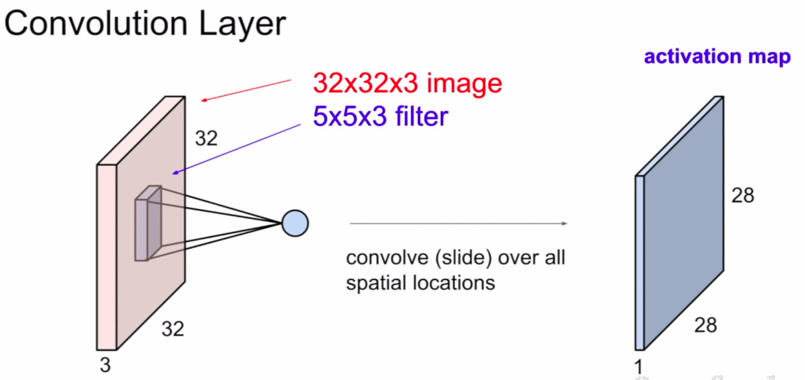

# 基础结构
## 全连接
- 输入到输出(单层)
  - 
- 输出到激活层
  - 
## RNN
- 多用于序列(sequence)中
### 结构
- RNN结构
  - 
- **思考**
  - 将输入$x_1$,$x_2$,$x_3$拼接起来当成全连接的输入，$y_1$,$y_2$,$y_3$当成输出也可以，全连接可行
  - 当输入维度不等时，采用定长的输入，缺少项补0，全连接可行
  - 但是存在问题
    - 全连接容易过拟合，在测试集效果不佳
    - 输入维度过高时，内存可能不足
- **Deep RNN**
  - 
- **Bidirectional RNN**
  - 
- **Pyramidal RNN**
  - 
### 函数
- RNN基础函数关系
  - 
- LSTM
  - 
  - 
  - 
  - 
    - $z^f$控制$c^{t+1}$的流入
    - $z^i$控制$z$的流入
- GRU
  - 
  - 参数量比LSTM少一个Matrix.(不一定对,目前没有论证,提出者的说法)
    - 注意:GRU的黄色箭头是同一个Matrix,$h^{t-1}$与$x^t$拼接与黄色箭头相乘
- Stack RNN
  - 
    - 将输入存入一个stack中
    - 参数量与输入无关,与设定的取stack元素的个数有关
### RNN example
- 
  - 简易语音信号,从每一小段时间的语音信息提取特征,期望输出对应音调
- 
  - RNN中对序列通常进行延时预测,最后部分补0.
    - 即时预测由于信息不够完备,相对困难.
- 
- 
### LSTM内部结构测试
- 
  - 箱型图是分类错误率;直方图是参数个数
### 不同RNN在不同实验上的结果
- 
  - Tanh:Navie RNN
  - MUT:通过遗传算法搜索的RNN结构,父种群为LSTM和GRU
    - 
## CNN
- 
- 
- 
- 
- 
- 
- 
## example:combination of different basic layers
- 
- 
  - 上图下侧是第一层卷积的卷积核可视化结果
- 