# Computational Graph & Backpropagation
## Computational Graph 全连接
- 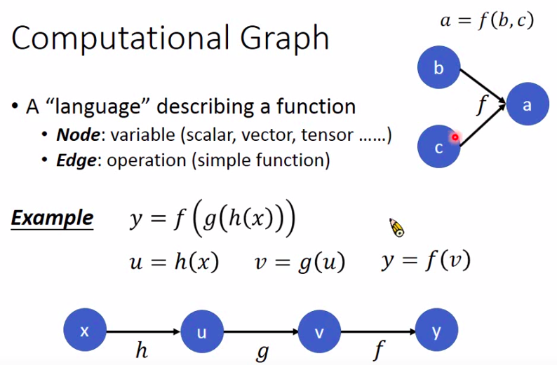
- 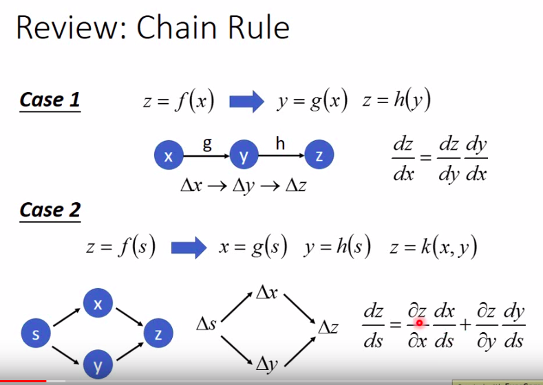
- 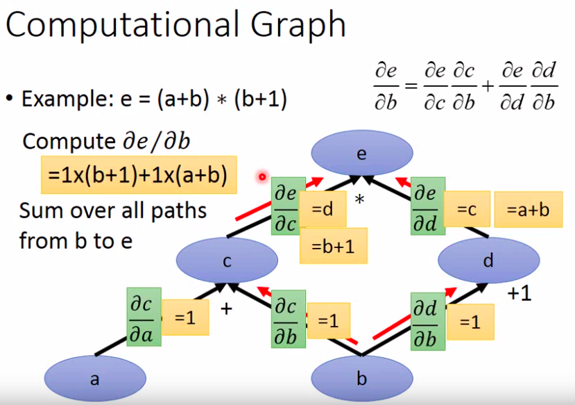
- 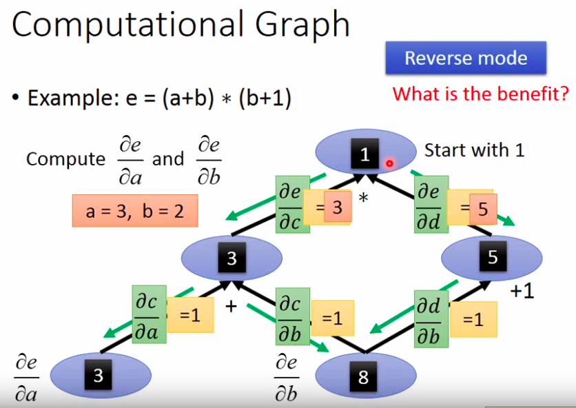
- 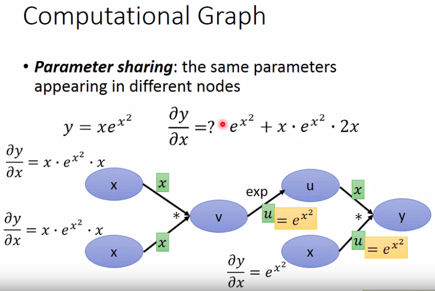
  - 把每个x元素当成不同的x,所以这里v对x的导数是x
- 反向传播_传统方法(麻烦)
  - 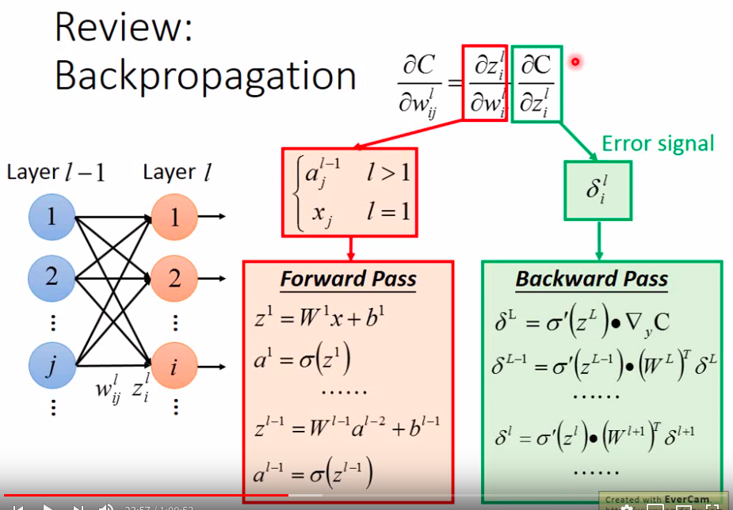
- 计算图
  - 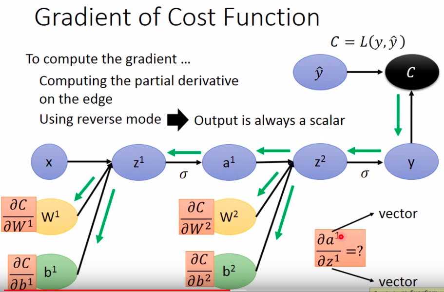
- 向量求导
  - 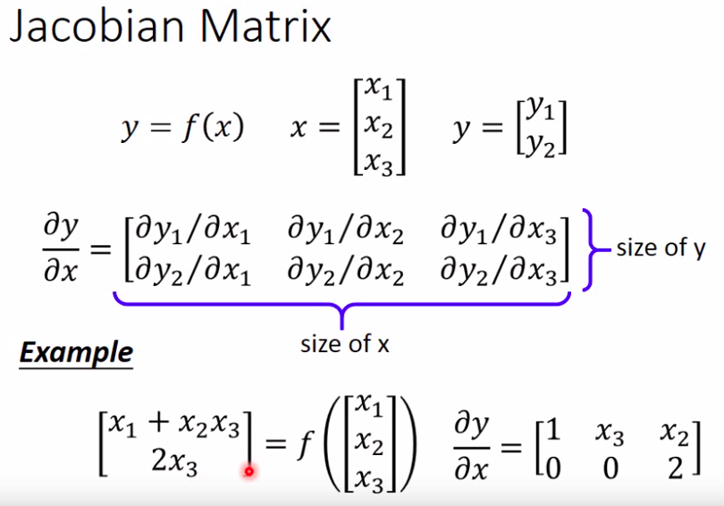
- 假设cost为交叉熵
  - 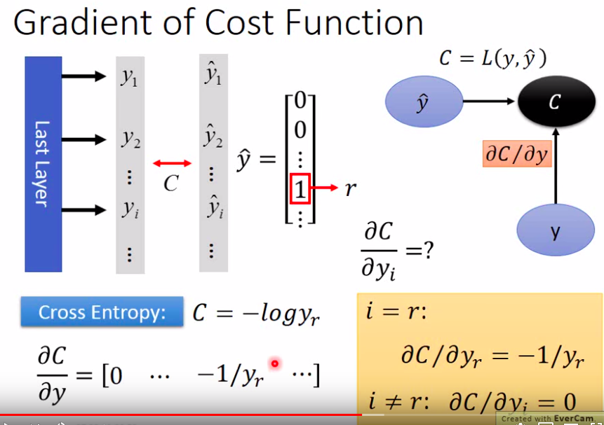
- 激活函数求导
  - 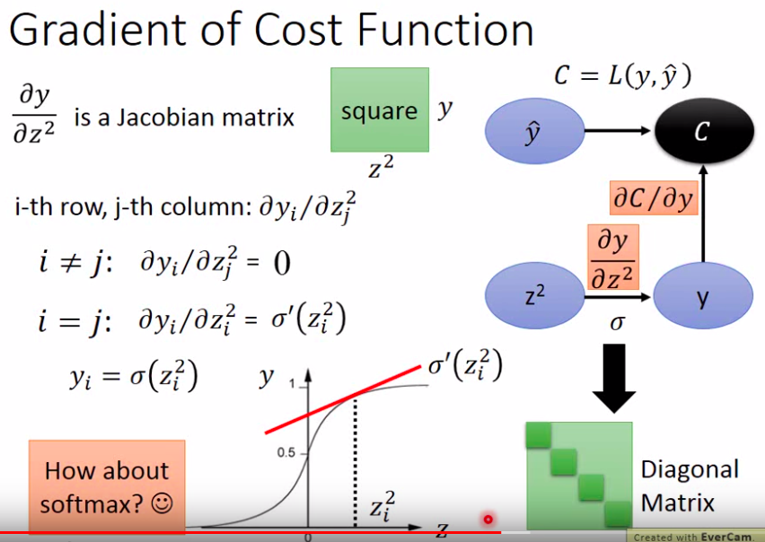
    - 这里的上标不是次方数,而是用于分辨变量的一个数
- 神经元求导
  - 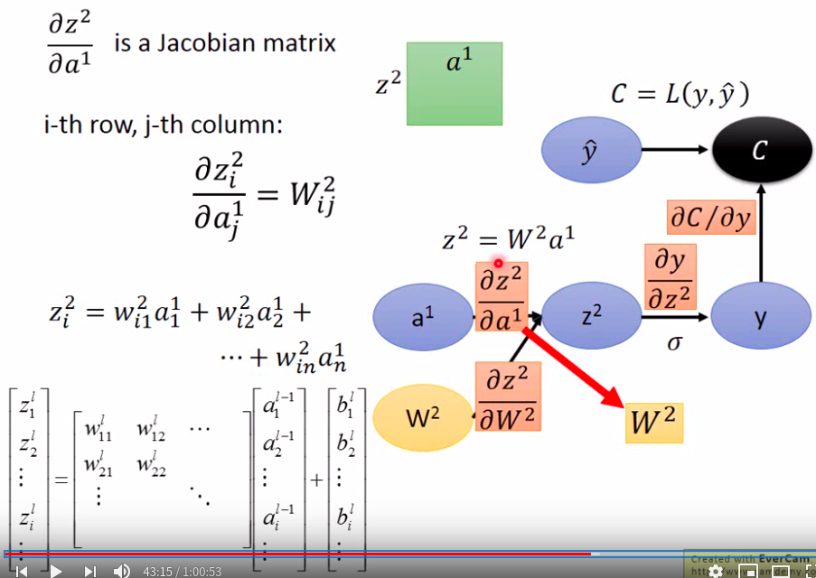
- 权重求导
  - 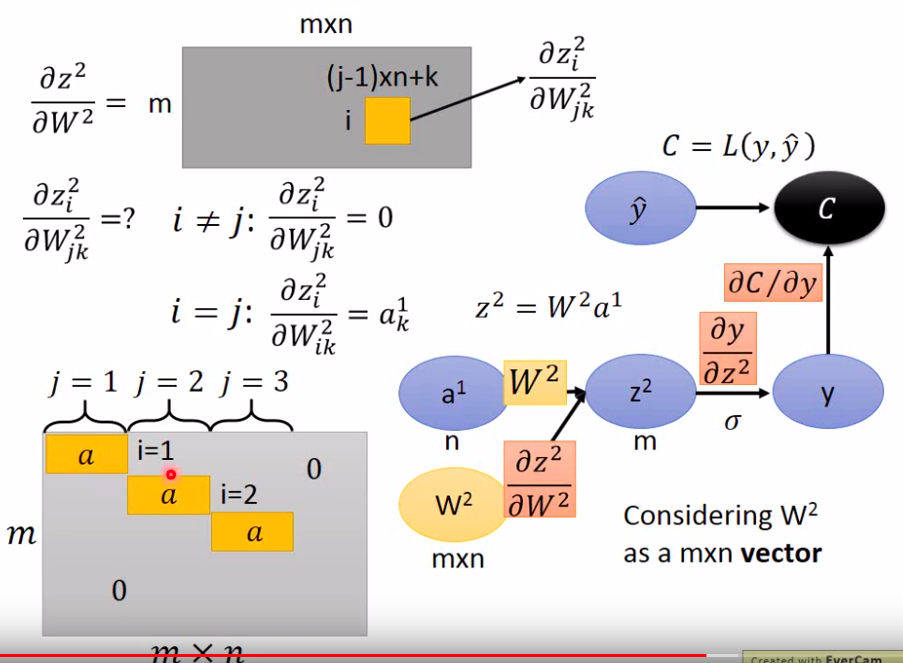
    - 拉直,看成向量,求雅可比矩阵
- cost对神经元某一项求导
  - 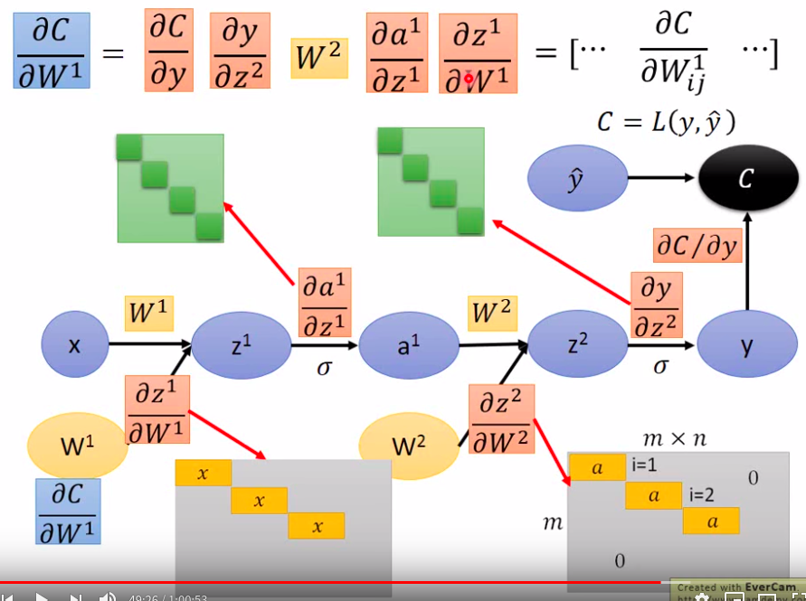
## Computational Graph RNN
- 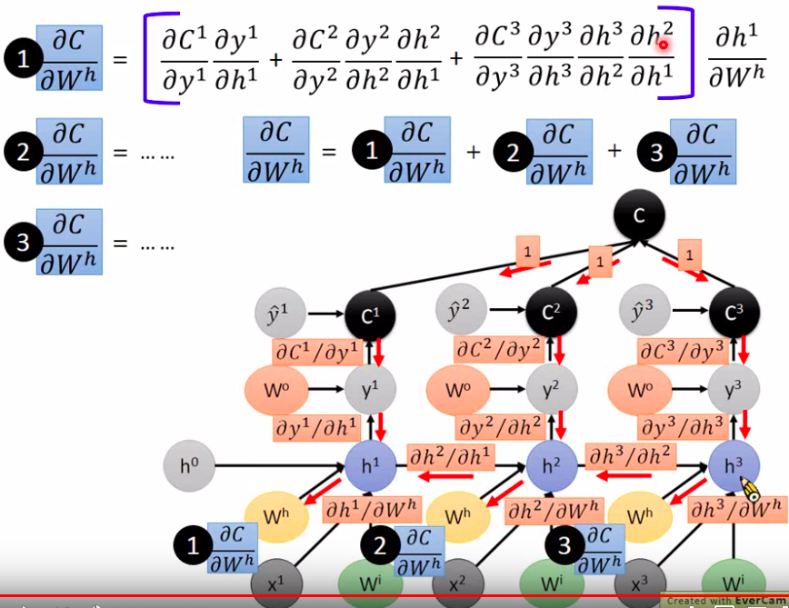
  - 梯度下降可能会出现问题,导数连乘多次,多用LSTM、GRU