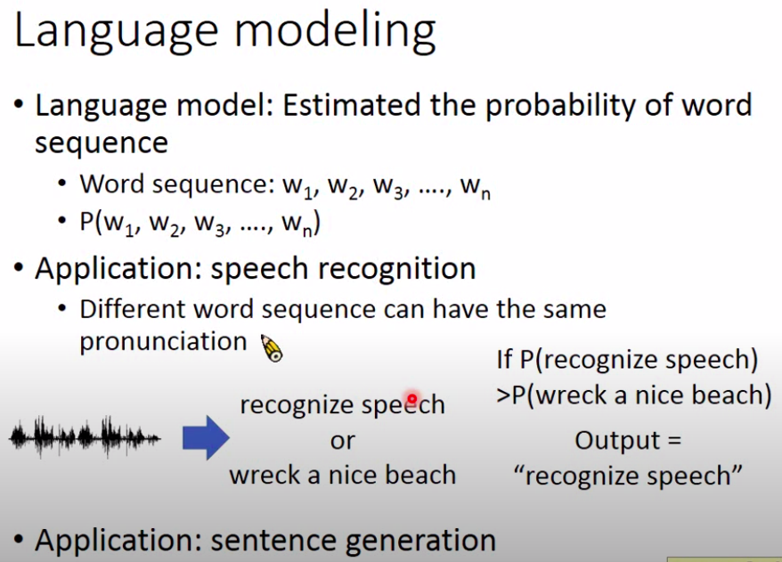
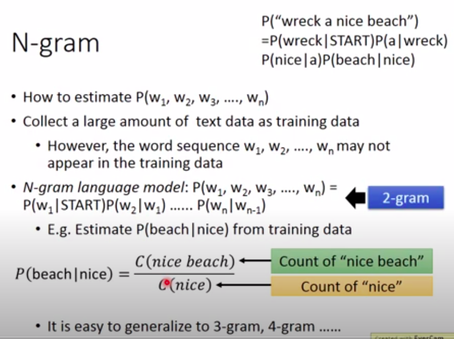
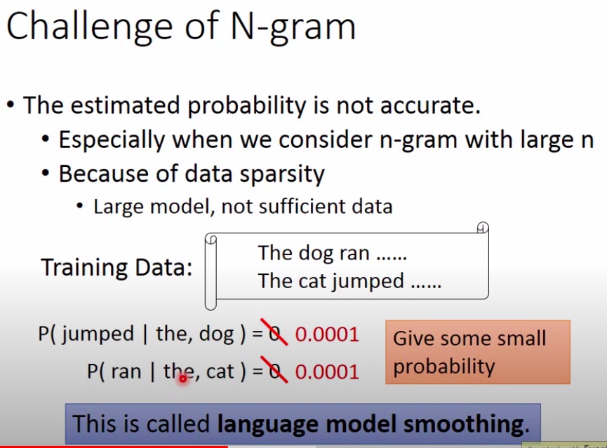
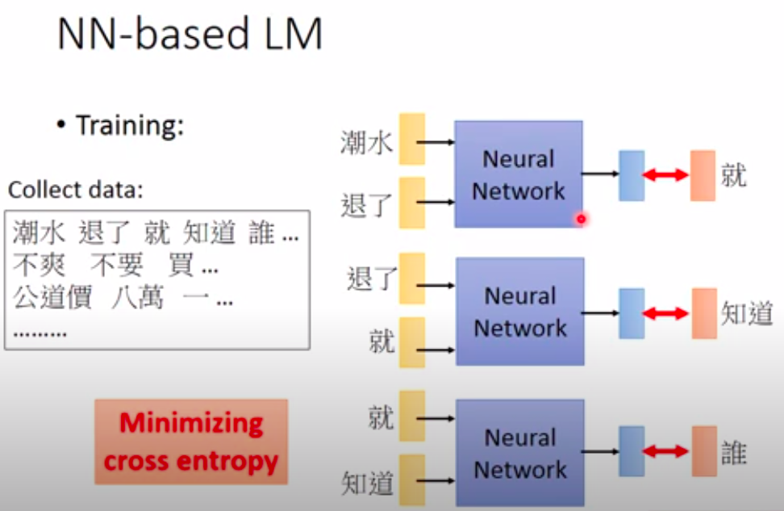
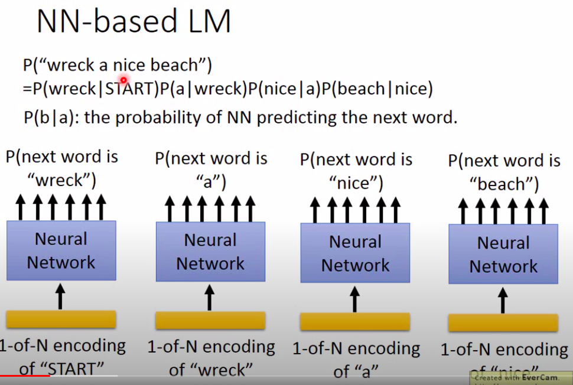
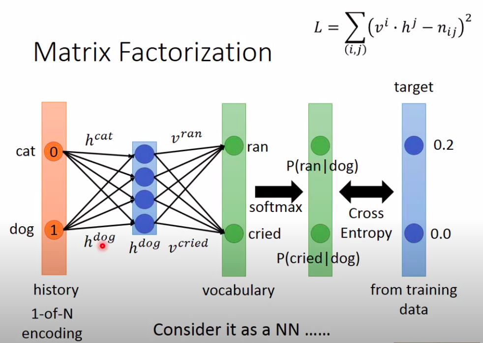
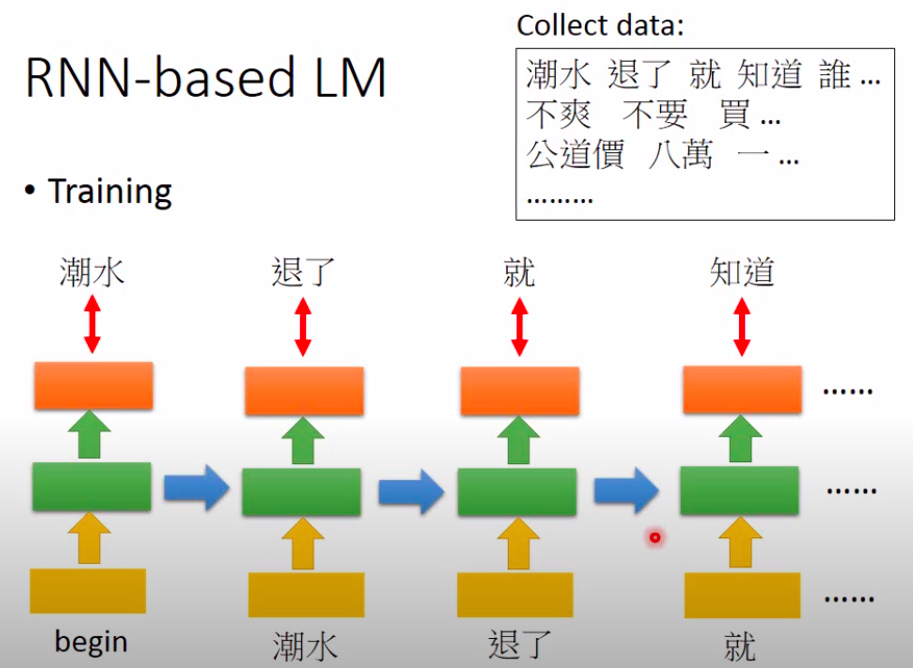
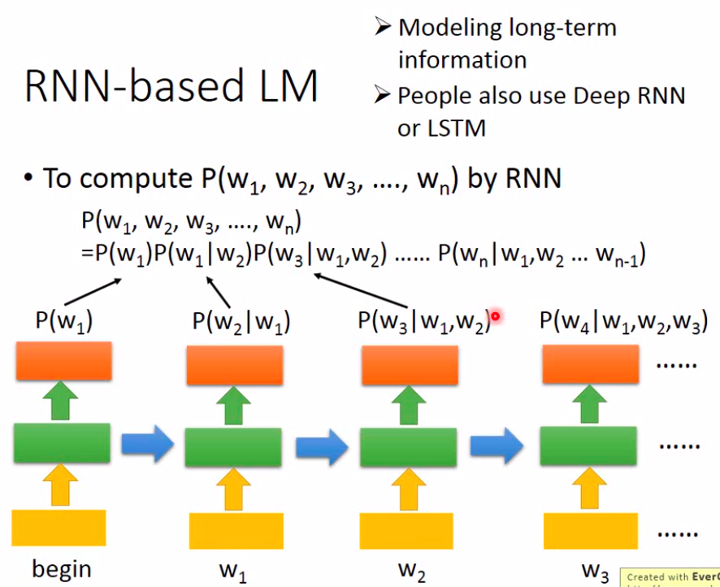

# Language Modeling
- 
  - 语音识别:不同句子具有相同发音，语言模型可以识别到底是哪个句子
  - 语句生成

## N-gram
- 
  - 数学简化假设
  - [N-gram 详细介绍](https://blog.csdn.net/songbinxu/article/details/80209197)
- 
### 可将N-gram学习的参数看作是学习一个矩阵
- 

## NN-based LM
- 
- 
  - NN为什么可以比N-gram效果好?
  - 用的参数更少
### 将NN-based LM看作是学习两组矩阵
- 
  - 两组矩阵h,v:通过梯度下降得到
  - 真值是数据集中的P(输出|输入)
- 
- 
  - N-gram:(m,n):假设输入编码为(m,1)、输出编码为(n,1)
  - NN:(m,x)+(x,n)

## RNN-based LM
- 
- 
  - RNN参数比NN更少
- 