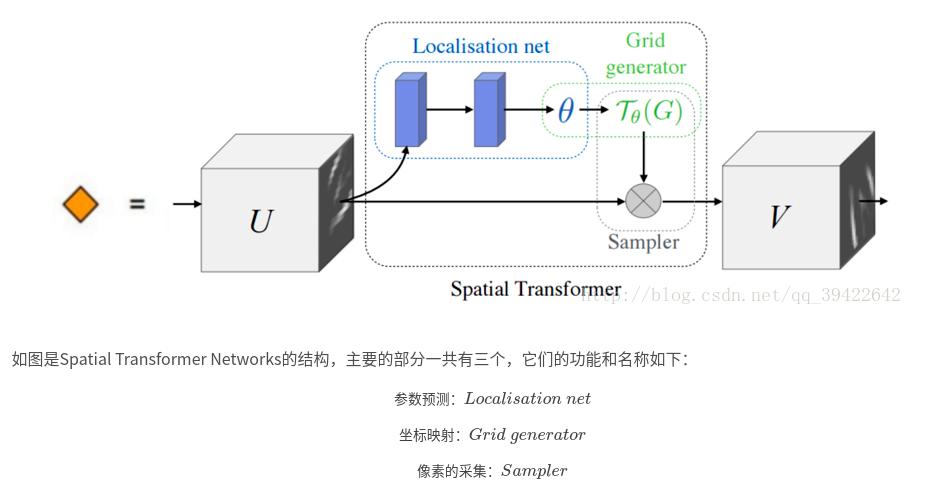
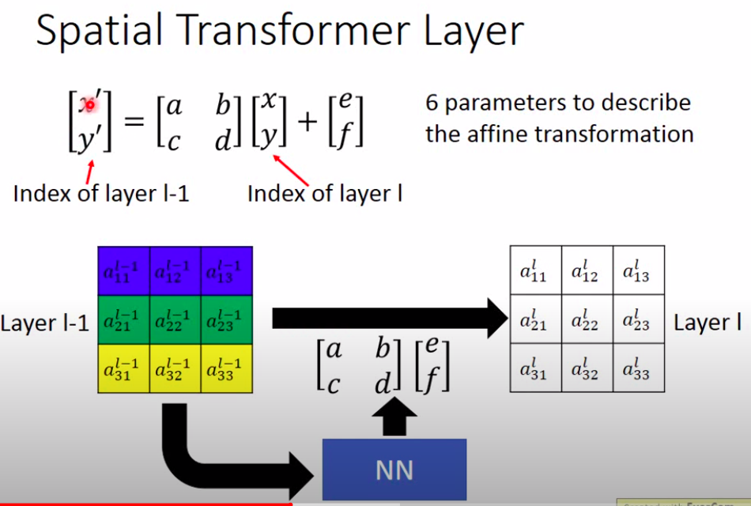
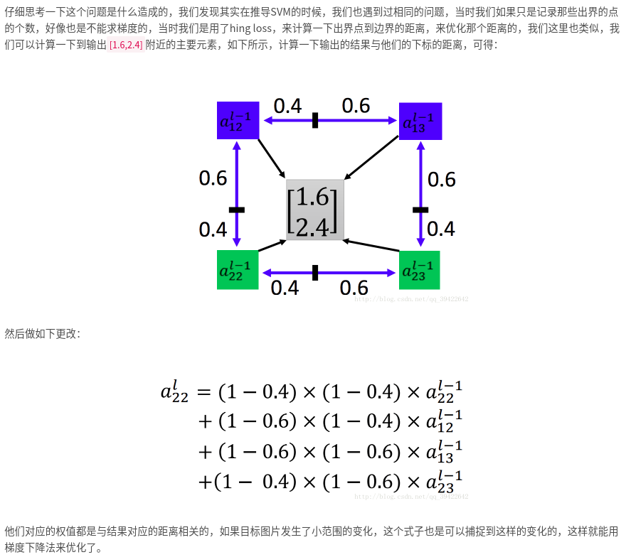

# Spatial Transformer Layer
- CNN本身其实不具有缩放旋转不变的特性，通常是通过添加不同原始数据训练来识别
  - 而maxpool一定程度地赋予了CNN平移不变特性
- Spatial Transformer Layer就是用来改善CNN缩放旋转不变的一种手段
- 
## 基本架构
- 
### 参数预测+坐标映射
- 
- 参数预测
  - NN权重 [仿射变换](https://www.zhihu.com/question/20666664) 的参数
  - NN输入和输出:元素索引，注意左乘$T_{目标\to 原}$
- 坐标映射
  - 输入输出之间的公式
- 梯度问题
  - NN输出时存在非整数元素
    - 取整:无法计算梯度，gradient=0
    - 
### sample
- 相当于进行仿射变换,根据仿射变换进行图像插值

---
- [参考](https://blog.csdn.net/qq_39422642/article/details/78870629)