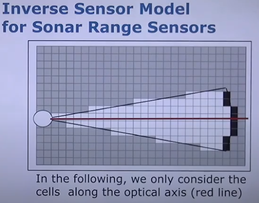
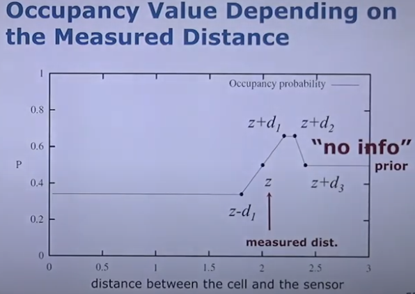
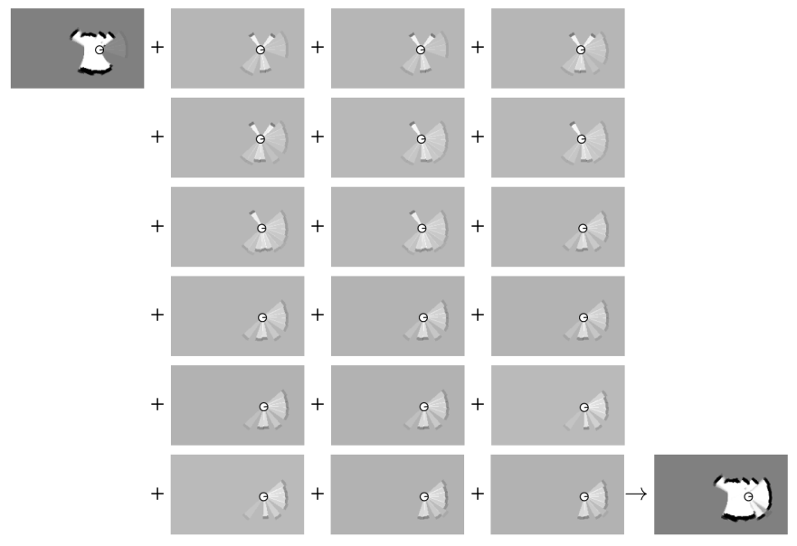
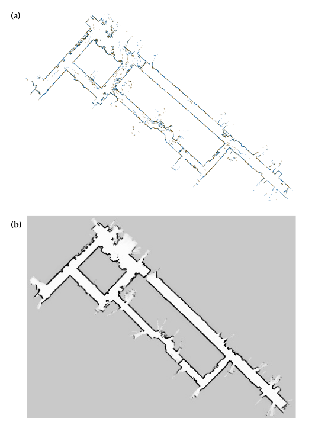

## Description of Mapping Task
- 根据传感器数据(观测值、动作值)计算得到最可能的地图
  - $m^*=argmax_m P(m|u_1,z_1,\dots ,u_t,z_t)$
- 占用栅格地图:假设机器入的位姿已知,根据观测值(测量值)生成地图.常用于规划导航
  - $m^*=argmax_m P(m|x_1,z_1,\dots ,x_t,z_t)$
  
## Example

**Figure 9.1** _原始地图数据和得到的占用栅格地图_

## Assumption
### Assumption 1
- 用一系列随机变量来表示地图,每个随机变量是一个二值数据,表示该位置是否被占用。
  - 状态只有0或1

- occupancy probabilty
  - $m=\{ m_i\}$
    - $m_i$:第i个栅格单元
  - 每个$m_i$与一个二值变量相对应，表示这个栅格单元是否被占用
  - $p(m_i=occu)或p(m_i)$:该栅格被占用的prob

### Assumption 2
- 世界是静态的

### Assumption 3
- 网格单元相互独立
- $p(m)=p(m_1,m_2,\dots,m_N)=\prod_i p(m_i)$

## Estimating a Map From Data
- $p(m|z_{1:t},x_{1:t})=\prod_i p(m_i|z_{1:t},x_{1:t})$
  - :interrobang: 这里$x_t$如果是$z_{1:t},u_{1:t}$的充分统计量,那么为什么不能直接$p(m_i|x_t)$
  - [:link:$x_t$充分统计量](Recursive-State-Estimation.md)
- $\begin{aligned}
  p(m_i|z_{1:t},x_{1:t})&\stackrel{Bayes\;rule}{=} \frac{p(z_t|m_i,z_{1:t-1},x_{1:t})p(m_i|z_{1:t-1},x_{1:t})}{p(z_t|z_{1:t-1},x_{1:t})}\\
  &\stackrel{\;\;Markov\;\;}{=} \frac{p(z_t|m_i,x_t)p(m_i|z_{1:t-1},x_{1:t-1})}{p(z_t|z_{1:t-1},x_{1:t})}\\
  & \because p(z_t|m_i,x_t)\stackrel{Bayes\;rule}{=}\frac{p(m_i|z_t,x_t)p(z_t|x_t)}{p(m_i|x_t)}\\
  &\stackrel{Bayes\;rule}{=}\frac{p(m_i|z_t,x_t)p(z_t|x_t)p(m_i|z_{1:t-1},x_{1:t-1})}{p(m_i|x_t)p(z_t|z_{1:t-1},x_{1:t})}\\
  &\stackrel{\;\;\; indep. \;\;\;}{=}\frac{p(m_i|z_t,x_t)p(z_t|x_t)p(m_i|z_{1:t-1},x_{1:t-1})}{p(m_i)p(z_t|z_{1:t-1},x_{1:t})}
\end{aligned}$
- $\begin{aligned}
  p(\neg m_i|z_{1:t},x_{1:t})=\frac{p(\neg m_i|z_t,x_t)p(z_t|x_t)p(\neg m_i|z_{1:t-1},x_{1:t-1})}{p(\neg m_i)p(z_t|z_{1:t-1},x_{1:t})}
\end{aligned}$
- $\begin{aligned}
  \frac{p(m_i|z_{1:t},x_{1:t})}{p(\neg m_i|z_{1:t},x_{1:t})}&=\frac{\frac{p(m_i|z_t,x_t)p(z_t|x_t)p(m_i|z_{1:t-1},x_{1:t-1})}{p(m_i)p(z_t|z_{1:t-1},x_{1:t})}} {\frac{p(\neg m_i|z_t,x_t)p(z_t|x_t)p(\neg m_i|z_{1:t-1},x_{1:t-1})}{p(\neg m_i)p(z_t|z_{1:t-1},x_{1:t})}}\\
  &=\frac{p(m_i|z_t,x_t)p(m_i|z_{1:t-1},x_{1:t-1})p(\neg m_i)}{p(\neg m_i|z_t,x_t)p(\neg m_i|z_{1:t-1},x_{1:t-1})p(m_i)}\\
  &=\begin{aligned}
  &\underbrace{\frac{p(m_i|z_t,x_t)}{1-p(m_i|z_t,x_t)}}\\
  &\qquad use\; z_t
  \end{aligned}\begin{aligned}
  &\underbrace{\frac{p(m_i|z_{1:t-1},x_{1:t-1})}{1-p(m_i|z_{1:t-1},x_{1:t-1})}}\\
  &\qquad \qquad 递归项
  \end{aligned}\begin{aligned}
  &\underbrace{\frac{1-p(m_i)}{p(m_i)}}\\
  &\quad prior
  \end{aligned}
\end{aligned}$

- 令$l(x)=log(\frac{p(x)}{1-p(x)})$
  - $p(x)=1-\frac{1}{1+\mathbf{exp}(l(x))}$
  - $\begin{aligned}
    l(m_i|z_{1:t},x_{1:t})&=log(\frac{p(m_i|z_{1:t},x_{1:t})}{1-p(m_i|z_{1:t},x_{1:t})})\\
  &=\begin{aligned}
  &\qquad \underbrace{l(m_i|z_t,x_t)}\\
  &inverse\;sensor\;model
  \end{aligned}+
  \begin{aligned}
  &\underbrace{l(m_i|z_{1:t-1},x_{1:t-1})}\\
  &\qquad 递归项
  \end{aligned}-
  \begin{aligned}
  \underbrace{l(m_i)}\\
  prior
  \end{aligned}
  \end{aligned}$
  - **记为**$l_{t,i}=inv\_sensor\_model(m_i,x_t,z_t)+l_{t-1,i}-l_0$

- 算法:
$\begin{aligned}
  &Algorithm\; occupancy\_grid\_mapping(\{l_{t-1,i}\},x_t,z_t):\\
  &\quad for\; all\; cells\; m_i\; do\\
  &\qquad if\; m_i\; in\; perceptual\; field\; of\; z_t\; then\\
  &\qquad \qquad l_{t,i}=l_{t-1,i}+inverse\_sensor\_model(m_i,x_t,z_t)-l_0\\
  &\qquad else\\
  &\qquad \qquad l_{t,i}=l_{t-1,i}\\
  &\qquad endif\\
  &\quad endfor\\
  &\quad return\; \{l_{t,i}\}
\end{aligned}$

# Example Incremental Updating Of Occupancy Grids
- 
- 

**Figure 9.4** _左上初始地图、中间4列根据逆传感器模型构建的局部地图、右下结果地图.采用半径2.5m内的测量数据,每个锥体打开角度约为15度_

**Figure 9.4** _用正确位姿信息得到的原始激光测距数据(由于人们在数据采集期间在机器人附近行走,因此有些障碍物是动态的)vs占用栅格地图(灰度表示后验概率,黑色表示高可能性被占用,白色表示高可能性不被占用,灰色表示先验概率)._

- 占用栅格地图比原始数据地图滤除了环境中动态的人等,更适用于导航规划