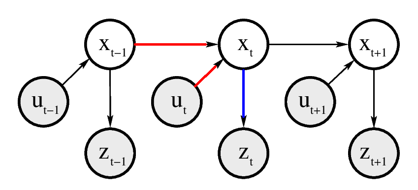

# Basic Concepts in Probability
> 在Probability Robotics中，将**传感器的测量数据**、**控制**、**机器人的States**（通常是位姿）、**机器人所在环境**看作是 **随机变量**（可用均值方差等进行描述）。

- 定义$X$为一个随机变量，$x$代表变量$X$可能的一个值，$X=x$代表一个事件。 
  例如：$X$为“抛一枚硬币，硬币向上的面”，$x_1$为“正面”，$x_2$为“反面”,$X=x_1$为事件“抛一枚硬币，硬币向上的面为正面”。
  - 离散：$\sum_x p(X=x)=1$&emsp;&emsp;&emsp;&emsp;连续：$\int_x p(X=x)=1$
- 后文简写
  - $p(x)\to p(X=x)$
  - $p(x,y)\to p(X=x\;and\;Y=y)$
- 均值：
  - $离散：E[X]=\sum_x xp(x) \qquad \qquad 连续：E[X]=\int xp(x)dx$
- 方差：$Cov[X]=E[X-E[X]]^2=E[X^2]-E[X]^2$
- 熵：（待修正）
  - $H[X]=H_p(x)=E[-log_2p(x) ]$
  - $H[X=x_1]=H_p(x_1)=-p(x_1)log_2p(x1)$
  - $离散：H_p(x)=-\sum_x p(x)log_2p(x) \qquad \qquad 连续：H_p(x)=-\int p(x)log_2p(x)dx$
  - 熵的一些理解和性质：
    - 常用于描述一个系统的信息含量的量化指标，$H[X ]$。
    - 单调性，发生概率越高的事件，携带的信息量越低
    - 非负性
    - 累加性
      - $X,Y$是两个不同的随机变量，他们对应的事件都相互独立。
      - $$\begin{aligned}
        H[X=x_1\cap Y=y_1]&=H_p(x_1,y_1)\\
        &=H_p(x_1)+H_p(y_1)
      \end{aligned}$$ 
    - 物理意义：对于一个随机变量$X$，其各个状态出现的频率不同，对其进行编码，所求的最短编码长度为信息熵。（哈夫曼树）
- 正态分布：$X\sim N(x;\mu,\sigma^2)$
  - 一维正态分布：$p(x)=(2\pi\sigma^2)^{-\frac{1}{2} }exp\left\{-\frac{(x-\mu)^2}{2\sigma^2}\right\}$
  - 多维正态分布：
    - $X=\begin{bmatrix}
        X_1 \\ X_2 \\ \vdots \\ X_n
    \end{bmatrix} \qquad \qquad \qquad
    \mu=E[X]=\begin{bmatrix}
        \sum_i p_ix_{1i} \\ \sum_i p_ix_{2i} \\ \vdots \\ \sum_i p_ix_{ni}
    \end{bmatrix}$
    - $\Sigma=E[(X-\mu)(X-\mu)^T]\\
    =\begin{bmatrix}
        E[(X_1-\mu_1)(X_1-\mu_1) ] & E[(X_1-\mu_1)(X_2-\mu_2) ]& \dots & E[(X_1-\mu_1)(X_n-\mu_n) ]\\
        E[(X_2-\mu_2)(X_1-\mu_1) ] & E[(X_2-\mu_2)(X_2-\mu_2) ]& \dots & E[(X_2-\mu_2)(X_n-\mu_n) ]\\
        \vdots                     & \vdots                    & \ddots & \vdots    \\
        E[(X_n-\mu_n)(X_1-\mu_1) ] & E[(X_n-\mu_n)(X_2-\mu_2) ]& \dots & E[(X_n-\mu_n)(X_n-\mu_n) ]
    \end{bmatrix}$
    - $\begin{aligned}
      p(x)&=\frac{ 1 }{ \sqrt{ \begin{vmatrix} 2\pi\Sigma \end{vmatrix} } }exp\left\{ {-\frac{1}{2}(x-\mu)^T\Sigma^{-1}(x-\mu)}\right\}\\
      &=\frac{ 1 }{ \sqrt{ (2\pi)^n\begin{vmatrix} \Sigma \end{vmatrix} } }exp\left\{ {-\frac{1}{2}(x-\mu)^T\Sigma^{-1}(x-\mu)}\right\}
    \end{aligned}$
- 条件概率$$p(x|y)=\frac{p(x,y)}{p(y)}$$如果$X$与$Y$相互独立，有：$$p(x|y)=\frac{p(x,y)}{p(y)}=\frac{p(x)p(y)}{p(y)}=p(x)$$
- 全概率公式
  - 离散：$p(x)=\sum_y p(x|y)p(y)$
  - 连续：$p(x)=\int p(x|y)p(y)dy$
  - 离散域证明：
    $if\;S=y_1 \cup y_2 \\
    p(x)=\sum_y p(x|y)p(y) \\
    \qquad =p(x|y_1)p(y_1)+p(x|y_2)p(y_2) \\
    \qquad =p(x,y_1)+p(x,y_2) \\
    \qquad =p(x \cap y_1) + p(x \cap y_2) \\
    \qquad \qquad \because (x \cap y_1)\cup (x \cap y_2)=x \cap (y_1 \cup y_2)=x \cap S=x \\
    \qquad =p(x)$
- 贝叶斯公式
  $$离散：\qquad p(x|y)=\frac{p(y|x)p(x)}{p(y)}=\frac{p(y|x)p(x)}{\sum_{x'}p(y|x')p(x)}\tag{1}\\
  连续：\quad p(x|y)=\frac{p(y|x)p(x)}{p(y)}=\frac{p(y|x)p(x)}{\int_{x'}p(y|x')p(x)dx'}$$
  - 假设$y$是数据（eg:传感器测量数据），$x$为需要从$y$中推测的状态。那么，$p(x)$被称为先验概率分布，$p(x|y)$被称为后验概率分布。在机器人学中，$p(y|x)$被称为生成模型，它在某种程度上描述了状态变量$X$会产生怎样的传感器测量值$Y$。
  - 在贝叶斯公式中，$p(y)$不依赖于$x$，对于任意$x$，都有相同的$p(y)$。**$p(y)^{-1}$通常记为$\eta$，当作贝叶斯公式的正规化子（归一化变量）**。
  $$p(x|y)=\eta p(y|x)p(x)$$
  在其他公式中，$\eta$都是正规化子（归一化变量）。
- 扩展基本公式
  - $p(x|y),$令$y=(y,z)$有：$$\begin{aligned}
    p(x|y,z) &= \frac{p(x,y,z)}{p(y,z)}=\frac{p(y|x,z)p(x,z)}{p(y|z)p(z)}=\frac{p(y|x,z)p(x|z)p(z)}{p(y|z)p(z)}\\
    &=\frac{p(y|x,z)p(x|z)}{p(y|z)}
  \end{aligned}\tag{2}$$
  - **条件独立**
    - 若$X,Y$相互独立有：$p(x,y)=p(x)p(y)$
  令$x=x|z,y=y|z$，即$X|Z$与$Y|Z$独立（$X,Y$在$Z$条件下条件独立），有：
  $$X\bot Y|Z \Rightarrow p(x,y|z)=p(x|z)p(y|z)\tag{3}$$
    - 若$X,Y$在$Z$条件下条件独立：
  $$\begin{aligned}
    \because p(x|z,y)&=\frac{p(x,y,z)}{p(y,z)}=\frac{p(x,y|z)p(z)}{p(y|z)p(z)}=\frac{p(x,y|z)}{p(y|z)}=\frac{p(x|z)p(y|z)}{p(y|z)}\\
    &=p(x|z)
  \end{aligned}$$  $$p(x|z)=p(x|z,y)\tag{4}$$   $$p(y|z)=p(y|z,x)\tag{5}$$
  - 注意：
$$\require{enclose}
X,Y在Z条件下条件独立 \Leftrightarrow (3)\quad (4)\quad (5) \enclose{downdiagonalstrike}{\Leftrightarrow}\;X,Y在Z相互独立
$$

  - 条件件独立举例：
    两枚硬币，一枚均匀，一枚0.9概率为正，0.1概率为负。做如下操作，首先随机选择一枚硬币，然后投掷两次，现定义如下3个随机变量：
    - $C$：随机选择一枚硬币
    - $X_1$：第一次投掷的正反面情况
    - $X_2$：第二次投掷的正反面情况
    考虑现在做第一次投掷，$X_1$，如果为正面则第二次投掷为正面的概率。如果知道选中的是哪一枚硬币，显然第二次投掷与第一次投掷彼此是独立的。因此$X_1\bot X_2 |C$。

  - **条件独立与马尔科夫性**
    - $p(x|z,y)=p(x|z)$，条件中有$z$，则$x$的出现不受$y$影响。
    - $z$代表现在，$x$代表未来，$y$代表过去。未来发生的概率只和现在有关而与过去无关。

# Robot Environment Interaction

*__Figure2.1__ Robot environment interaction*

## State
state: the collection of all aspects of the robot and its environment that can impact the future.
> 机器人及其环境所有会对未来产生影响的因素的集合。

$x_t$代表$t$时刻的state。典型的状态变量有：
1. 机器人位姿：相对于全局坐标系的位置（location）和方向（orientation）。
    > 刚体移动机器人用6个变量描述位姿，3个代表坐标，3个（pitch,roll,yaw）代表方向。受限于平面环境，位姿通常用3个变量进行描述，2个代表平面位置，1个（yaw）代表头部朝向。
2. 机器人运动学状态：有关机器人执行机构配置的变量。（在本书中基本不涉及）
    > 例如转动关节的关节角度。
3. 机器人动态状态：机器人速度和角速度。（在本书中基本不涉及）
4. 环境中周围物体的位置和特征。
    > 本书中：环境物体的位置都是静态的，并且将物体假设为地标 (landmarks) 形式（可被可靠识别的明显的固定的环境特征）。
5. 移动的物体和人的位置、速度。
6. 其他可影响机器人运行的状态变量。
    > 例如，传感器是否故障、电池的充电等级等。
7. 无数潜在的状态变量。

- 未来可以是随机的,但是没有先于$x_t$的状态变量可以影响未来状态的随机变化,除非这种依赖通过状态$x_t$起作用。满足这些条件的暂态过程通常称为**马尔可夫链 (Markov chain)**。
  > 状态完整性：假设一个状态$x_t$可以最好地预测未来,则称其为完整的。
  
- **对任何一个实际的机器人系统不可能指定一个完整的状态**。一个完整的状态不仅包括对未来有影响的环境的所有方面，而且也包括机器人本身、计算机内存的内容以及周围人造成的信息垃圾等。其中有些是很难获得的。现实的实现是挑选所有状态变量的小子集，如上面所列的那些。

## Environment Interaction
环境交互包括：
1. 传感器测量值。
    > 通过感知，机器人利用传感器获得环境状态的信息。通常情况下,传感器测量会有一些延迟,它们提供的是几分钟、几秒前的状态信息。
2. 控制动作。
    > 机器人通过执行机构影响环境的状态。

实际上，机器人连续地执行控制，同时进行测量。

**环境感知提供了环境状态的信息，因此往往会增加机器人的信息。另一方面，由于机器人执行机构的固有噪声和机器人环境的随机性，运动往往会引起信息的丢失。**

假设一个机器人可以保待所有过去的传感器测量和控制动作的记录。机器人获得两种不同的数据流。
1. 环境测量数据——提供了环境的暂态信息。
    - 忽略延迟影响，在时间$t$的测量数据表示为$z_t$。
    - $z_{t_1:t_2}=z_{t_1},z_{t_1+1},z_{t_1+2},...,z_{t_2}$表示从时间$t_1$到$t_2$获得的所有测量的集合。
2. 控制数据——携带环境中关于状态改变的信息。
    - 机器人的速度。设机器人的速度为10cm/s，并持续5s，表明在执行这个动作指令后，机器人的位姿大约比指令执行前向前了50cm。因此，控制传达了有关状态变化的信息。
    - 里程计是测量机器人轮子运行的传感器。它们传达了状态变化的信息。虽然里程计是传感器，但仍将里程计视为控制数据，因为它们测量了控制动作的影响。
    - $u_{t_1:t_2}=u_{t_1},u_{t_1+1},u_{t_1+2},...,u_{t_2}$表示从时间$t_1$到$t_2$控制数据的集合。假定每一时间步$t$只有一个控制数据，并且所有动作中包含了动作“什么都不做”。

## Probabilistic Generative Laws
通常，状态$x_t$是随机地由状态$x_{t-1}$产生的。
乍一看，状态$x_t$的出现可能是以所有过去的状态、测量和控制为条件的。此时，状态演变的概率可用$p(x_t|x_{0:t-1},z_{1:t-1},u_{1:t})$表示，其中，$u_{t}$是由于假定机器人首先执行一个控制动作$u_1$，然后得到一个测量$z_1$。

1.如果状态$x$是完整的，那么它是所有以前时刻发生的所有状态的充分总结。具体来说，$x_{t-1}$是直到$t-1$时刻的控制（$u_{1:t-1}$）和测量（$z_{1:t-1}$）的一个**充分统计量**。
2.马尔科夫性：未来只与现在有关而与过去无关。

由1和2可得：
$$p(x_t|x_{0:t-1},z_{1:t-1},u_{1:t})=p(x_t|x_{0:t-1},u_t)=p(x_t|x_{t-1},u_t)$$同理可得：
$$p(z_t|x_{0:t},z_{1:t-1},u_{1:t})=p(z_t|x_{0:t})=p(z_t|x_{t})$$

最终得到：$p(x_t|x_{t-1},u_t)$状态转移概率；$p(z_t|x_t)$测量概率。在动态贝叶斯网络中，当前变量只依赖于直接指向该变量的变量。

*__Figure2.2__ 表征控制、状态和测量演变特征的动态贝叶斯网络*

## Belief Distributions
置信度反映了机器人有关环境状态的内部信息。状态不能被直接测量。例如,在一个全局坐标系中机器入的位姿可能是$x_t=<14.12,12.7,45°>$，但是位姿(即使用 GPS)不能直接测量，必须**从数据中推测位姿**。
- 预测，$\overline{ bel}(x_t)=p(x_t|z_{1:t-1},u_{1:t})$
- 更新，$bel(x_t)=p(x_t|z_{1:t},u_{1:t})$

# Bayes Filter
## Bayes Filter algorithm
$\begin{aligned}
  &\mathbf{Algorithm \; Bayes\_filter}(bel(x_{t-1}),u_t,z_t): \\
  &\qquad for \; all \; x_t \; do\\
  &\qquad \qquad \overline{bel}(x_t)=\int p(x_t|u_t,x_{t-1})bel(x_{t-1})dx_{t-1}\\
  &\qquad \qquad bel(x_t)=\eta p(z_t|x_t) \overline{bel}(x_t)\\
  &\qquad endfor\\
  &\qquad return \; bel(x_t)
\end{aligned}$

- 推导见书籍

## Example

*__Figure2.3__ 估计门状态的移动机器人*

- 假设门只有开或关两种状态,且只有机器人可以改变门的状态,机器人可以观测门的状态
- 初始时，$bel(X_0=open)=0.5,bel(X_0=closed)=0.5$
- 假设传感器有噪声,噪声通过下面条件概率表征:
  - $p(Z_t=sense\_open|X_t=is\_open)=0.6$
  - $p(Z_t=sense\_closed|X_t=is\_open)=0.4$
  - $p(Z_t=sense\_open|X_t=is\_closed)=0.2$
  - $p(Z_t=sense\_closed|X_t=is\_closed)=0.8$
- 机器人可以通过操作改变门状态:
  - $p(X_t=is\_open|U_t=push,X_{t-1}=is\_open)=1$
  - $p(X_t=is\_closed|U_t=push,X_{t-1}=is\_open)=0$
  - $p(X_t=is\_open|U_t=push,X_{t-1}=is\_closed)=0.8$
  - $p(X_t=is\_closed|U_t=push,X_{t-1}=is\_closed)=0.2$
  - $p(X_t=is\_open|U_t=do\_nothing,X_{t-1}=is\_open)=1$
  - $p(X_t=is\_closed|U_t=do\_nothing,X_{t-1}=is\_open)=0$
  - $p(X_t=is\_open|U_t=do\_nothing,X_{t-1}=is\_closed)=0$
  - $p(X_t=is\_closed|U_t=do\_nothing,X_{t-1}=is\_closed)=1$

- 假设t=1时,机器人没有采取任何动作,但他检测到门是开着的
  - 没有采取动作
    - $\begin{aligned}
      \overline{bel}(x_1)&=\int p(x_1|u_1,x_0)bel(x_0)dx_0\\
      &=\sum_{x_0}p(x_1|u_1,x_0)bel(x_0)\\
      &=p(x_1|U_1=do\_nothing,X_0=is\_open)bel(X_0=is\_open)+\\
      &\qquad p(x_1|U_1=do\_nothing,X_0=is\_closed)bel(X_0=is\_closed)
    \end{aligned}$
    - 代入具体状态量
      - $\begin{aligned}
      \overline{bel}(X_1=is\_open)&=p(X_1=is\_open|U_1=do\_nothing,X_0=is\_open)bel(X_0=is\_open)+\\
      &\qquad p(X_1=is\_open|U_1=do\_nothing,X_0=is\_closed)bel(X_0=is\_closed)\\
      &=1\times 0.5+0\times 0.5\\
      &=0.5
      \end{aligned}$
      - $\begin{aligned}
      \overline{bel}(X_1=is\_closed)&=p(X_1=is\_closed|U_1=do\_nothing,X_0=is\_open)bel(X_0=is\_open)+\\
      &\qquad p(X_1=is\_closed|U_1=do\_nothing,X_0=is\_closed)bel(X_0=is\_closed)\\
      &=0\times 0.5+1\times 0.5\\
      &=0.5
      \end{aligned}$
  - 检测门开着
    - $bel(x_1)=\eta p(Z_1=sense\_open|x_1)\overline{bel}(x_1)$
    - 代入具体状态
      - $\begin{aligned}
        bel(X_1=is\_open)&=\eta p(Z_1=sense\_open|X_1=is\_open)\overline{bel}(X_1=is\_open)\\
        &=\eta0.6\times 0.5\\
        &=0.3\eta
      \end{aligned}$
      - $\begin{aligned}
        bel(X_1=is\_closed)&=\eta p(Z_1=sense\_open|X_1=is\_closed)\overline{bel}(X_1=is\_closed)\\
        &=\eta0.2\times 0.5\\
        &=0.1\eta
      \end{aligned}$
      - $\eta$:归一化因子
      - $bel(X_1=is\_open)=0.75$
      - $bel(X_1=is\_open)=0.25$
- 对于$u_2=push,Z_2=sense\_open$,可以得到
  - $\overline{bel}(X_2=is\_open)=1\times 0.75+0.8\times 0.25=0.95$
  - $\overline{bel}(X_2=is\_closed)=0\times 0.75+0.2\times 0.25=0.05$
  - ${bel}(X_2=is\_open)=\eta 0.6\times 0.95\approx0.983$
  - ${bel}(X_2=is\_closed)=\eta 0.2\times 0.05\approx0.017$
      