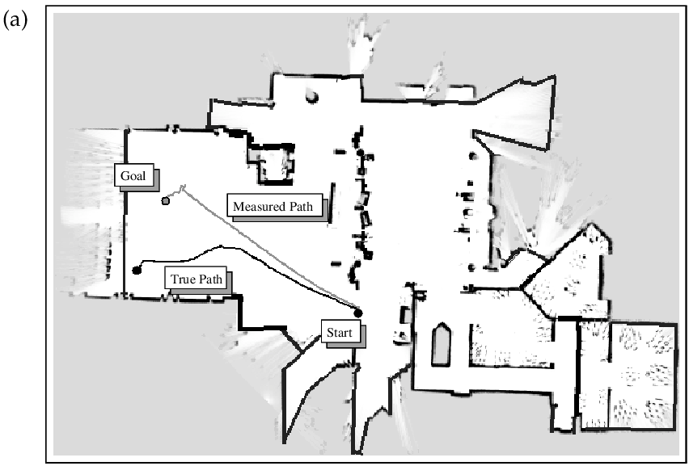

# Eg: mobile robot localization.  
## 问题描述
**机器人定位：估计机器人相对于外部参考坐标系的坐标。**
> 给定环境的地图信息，根据传感器采集的信号确定机器人相对于地图的位置。
<!--more-->
- 环境中具有3个难以区分的门，机器人需要通过感知和移动确定自身在哪。
  - $x$：某个状态（机器人所在位置）
  - $z$：观测值（机器人采集的传感器数据）
  - $bel(x)=p(x|z)$：根据传感器数据得到的**在所有位置的空间上的概率密度函数**
  - ~~$p(z|x)$：在机器人所在位置可能采集的传感器数据的概率密度函数~~

*__Figure1.1__ The basic idea of Markov localization*

## 图像描述 
- $a$：没有观测值$z$。
  - $bel(x)=p(x|z)$是一个均匀分布。
- $b$：第一次采集数据$z$，观测到它靠近门。利用**Bayes filter**更新$bel(x)$。
  - 新的$bel(x)$增大了在靠近门处的概率，减小了靠近墙处的概率。
  - 新的$bel(x)$具有3个峰，每个峰对应于环境中难以区分的门中的一个门，机器人无法知道它在哪。
- $b \to c$：机器人进行移动。
  - $bel(x)$随着机器人移动的方向移动，峰的范围由于机器人运动引起的不确定性具有更广的范围（更不精确）。
- $c \to d$：机器人移动过程中观测到另一扇门，Bayes filter根据这个观测更新$bel(x)$。
  - 新的$bel(x)$在靠近其中一扇门处具有很高的峰，机器人很确定它的位置。
- $e$：机器人沿着走廊走下去。
  - $bel(x)$随着机器人移动的方向移动，峰的范围由于机器人运动引起的不确定性具有更广的范围（更不精确）。

$bel(x)$的更新代表着**传感器获取信息**或者**由于某些行为导致机器人不确定性增加而产生的信息丢失**。

# Eg: coastal navigation
## 问题描述
> 概率学的算法不仅可以计算机器人某时刻的不确定性（定位），而且可以预测未来的不确定性（规划与控制）。
- 概率规划技术预测未来的不确定性，并计划信息收集，选择正确的动作。
- 概率控制技术用于实现规划的路径。

*__Figure1.2__*

## 图像描述
- $a$：机器人在开阔的、缺乏特征的空间里进行规划导航时，由于机器人运动引起的不确定性，可能会使机器人变得不确定它所在的位置，导致导航失败。
- $b$：通过靠近已知的障碍物（可被区分的拐角），贴近墙壁确保机器人定位的准确性、降低不确定性，避免导航失败。

