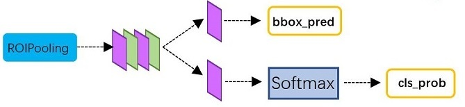

# Ref
- https://zhuanlan.zhihu.com/p/31426458
- https://zhuanlan.zhihu.com/p/145842317

# 整体流程

1. resize输入图像到MxN大小,送入网络
2. 骨干网络采用VGG16,13个conv层(s=1,pad=same),13个relu层以及4个pooling层,提取得到特征图
3. RPN网络首先经过3x3卷积，再分别生成positive anchors和对应bounding box regression偏移量，然后计算出proposals
4. Roi Pooling层则利用proposals从feature maps中提取proposal feature送入后续全连接和softmax网络作classification（即分类proposal到底是什么object）

## RPN

- **RPN在原图尺度上，设置候选Anchor。然后用cnn判断哪些Anchor是里面有目标的positive anchor，哪些是没目标的negative anchor。并且得到框的偏移量**
- anchor
  - 一组由rpn/generate_anchors.py生成的矩形.遍历Conv layers计算获得的feature maps(假设为FW*FH)，为每一个点配备9种anchors作为**初始的检测框**，后续的RPN+box回归修正两次检测框。
  - 直接运行作者demo中的generate_anchors.py可以得到以下输出：
    ```python
    [[ -84.,  -40.,   99.,   55.],#sx,sy,ex,ey
    [-176.,  -88.,  191.,  103.],
    [-360., -184.,  375.,  199.],
    [ -56.,  -56.,   71.,   71.],
    [-120., -120.,  135.,  135.],
    [-248., -248.,  263.,  263.],
    [ -36.,  -80.,   51.,   95.],
    [ -80., -168.,   95.,  183.],
    [-168., -344.,  183.,  359.]]
    ```
    3组长度值，3组长宽比$\frac{w}{h}\in\{1,\frac{1}{2},2\}$，共9个矩形(以锚点为中心点)
- 经过一层3x3卷积
  - 经过一层2*9深度，1x1卷积，得到用于二分类(是否包含目标)的FW\*FH\*(2\*9)
    - FW\*FH:与特征图尺度一样
    - 2:用于二分类
    - 9:每个锚点的初始检测框个数
    - pad:same
    - reshape:reshape到softmax输入的维度格式，然后reshape到与原维度格式对应的维度格式
  - 经过一层4*9深度，1x1卷积，得到用于得到初始检测框偏移量的FW\*FH\*(4\*9)
    - xywh的偏移量
- loss
  - 当图像中有 gt_boxes 时，计算 anchor 与 gt_box 的 IOU
    - 选择 IOU < 0.3 的 anchor 为 background，标签为 0
    - 选择 IOU > 0.7 的 anchor 为 foreground，标签为 1
    - 忽略 0.3 < IOU < 0.7 的 anchor，不参与训练
  - 偏移量训练
    - 输入gt
- 前向
  1. 生成anchors，利用$d_x(A),d_y(A),d_w(A),d_h(A)$对所有的anchors做bbox regression回归（这里的anchors生成和训练时完全一致）
  2. 按照输入的positive softmax scores由大到小排序anchors，提取前pre_nms_topN(e.g. 6000)个anchors，即提取修正位置后的positive anchors
  3. 限定超出图像边界的positive anchors为图像边界，防止后续roi pooling时proposal超出图像边界
  4. 剔除尺寸非常小的positive anchors
  5. 对剩余的positive anchors进行NMS（nonmaximum suppression）
  6. Proposal Layer有3个输入：positive vs negative anchors分类器结果，对应的bbox reg变换量，以及im_info。生成proposals

- 总结
  - **生成anchors -> softmax分类器提取positvie anchors -> bbox reg回归positive anchors -> Proposal Layer生成proposals**

## ROI Pooling
- 输入
  1. 原始的feature maps
  2. RPN输出的proposal boxes（大小各不相同）
- 前向
  1. 由于proposal是对应MxN尺度的，所以首先使用spatial_scale参数将其映射回(M/16)x(N/16)大小的feature map尺度；
  2. 再将每个proposal对应的feature map区域水平分为pooled_w,pooled_h的网格；
  3. 对网格的每一份都进行max pooling处理。
- 目的
  - **使大小不同的proposal输出结果都是pooled_w,pooled_h固定大小，实现了固定长度输出。**

## Classification
- 
- Classification部分利用已经获得的proposal feature maps，通过full connect层与softmax计算每个proposal具体属于那个类别（如人，车，电视等），输出cls_prob概率向量；同时再次利用bounding box regression获得每个proposal的位置偏移量bbox_pred，用于回归更加精确的目标检测框。

## 训练
- 见Ref