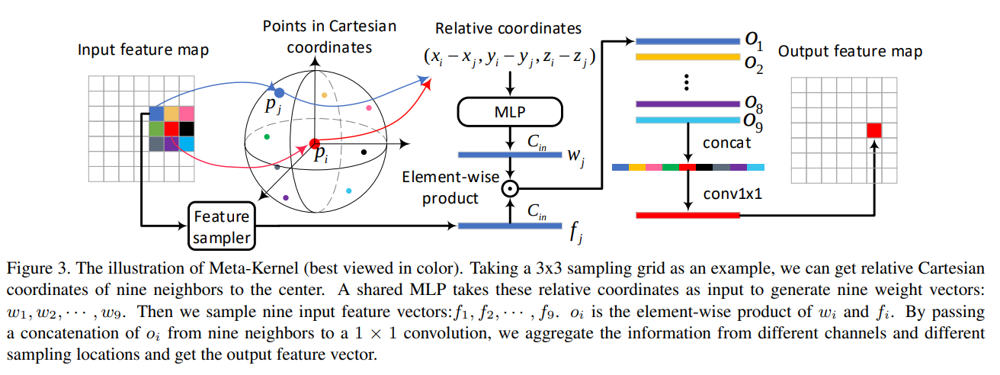

# 目标检测
## 2D目标检测
### R-CNN系列
- [FasterRCNN](FasterRCNN.md)

### YOLO系列
- [YOLO v1](YOLO%20v1.md)

### DETR系列

## 3D目标检测
### [SECOND]()

### RangeDet
- Meta-Kernel

- $f_j$:$j$所在位置周围卷积核范围的拉直特征(img2col)
- $x_j,y_j,z_j$:$j$像素对应的三维坐标
- 用Meta-Kernel代替卷积操作,考虑了三维空间的距离差,其中MLP通过整个网络的反向传播求值.