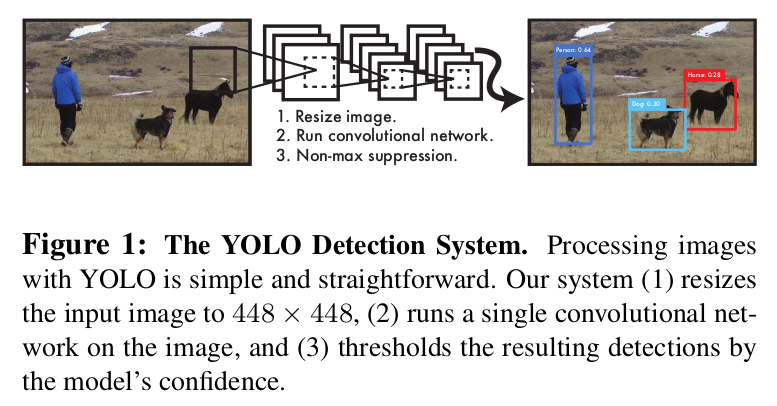
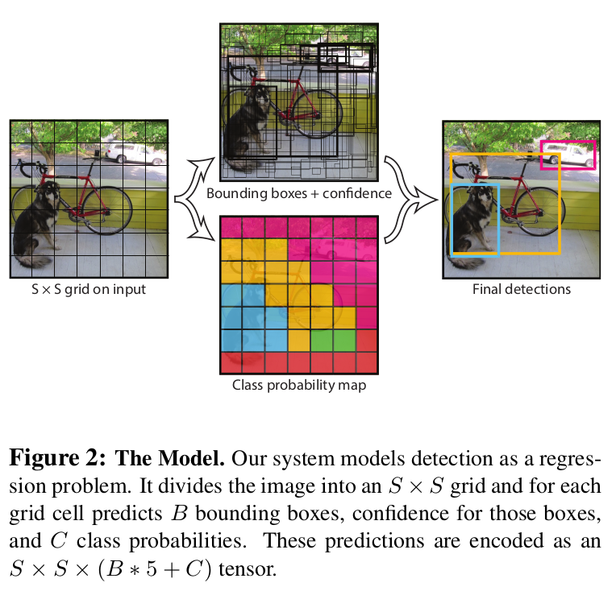
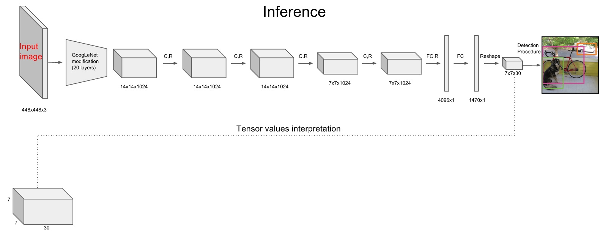
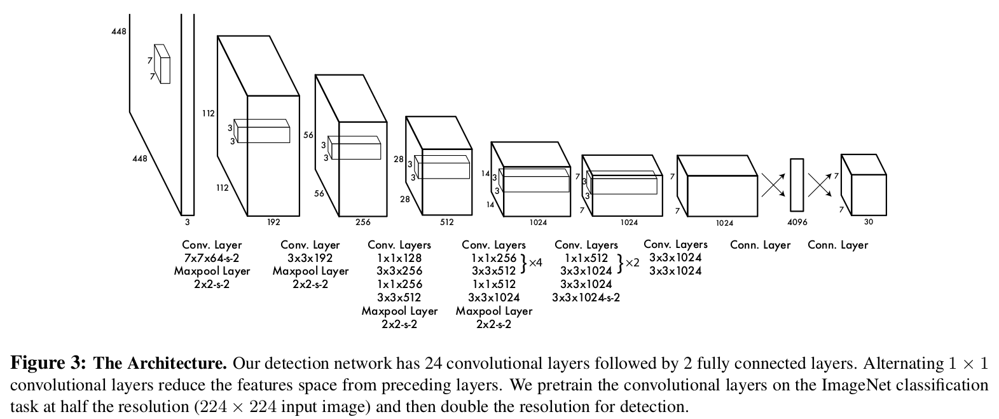
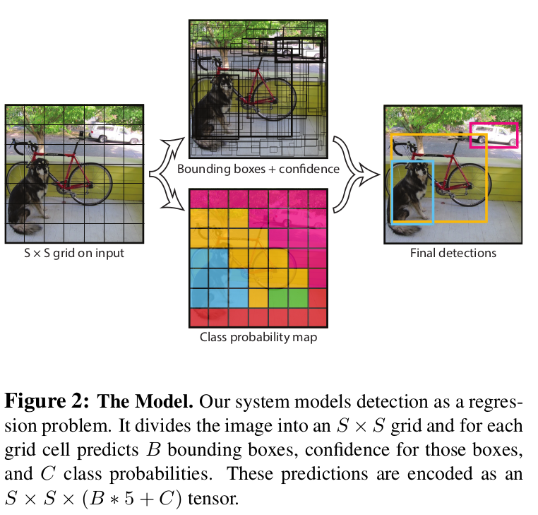
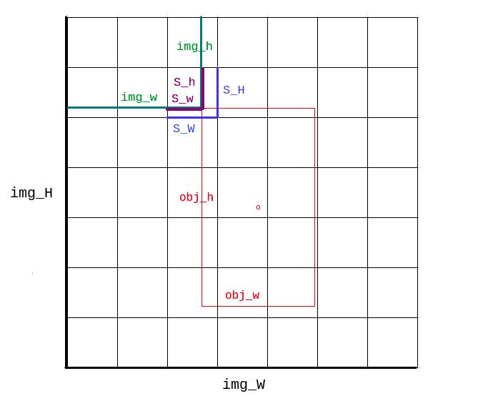
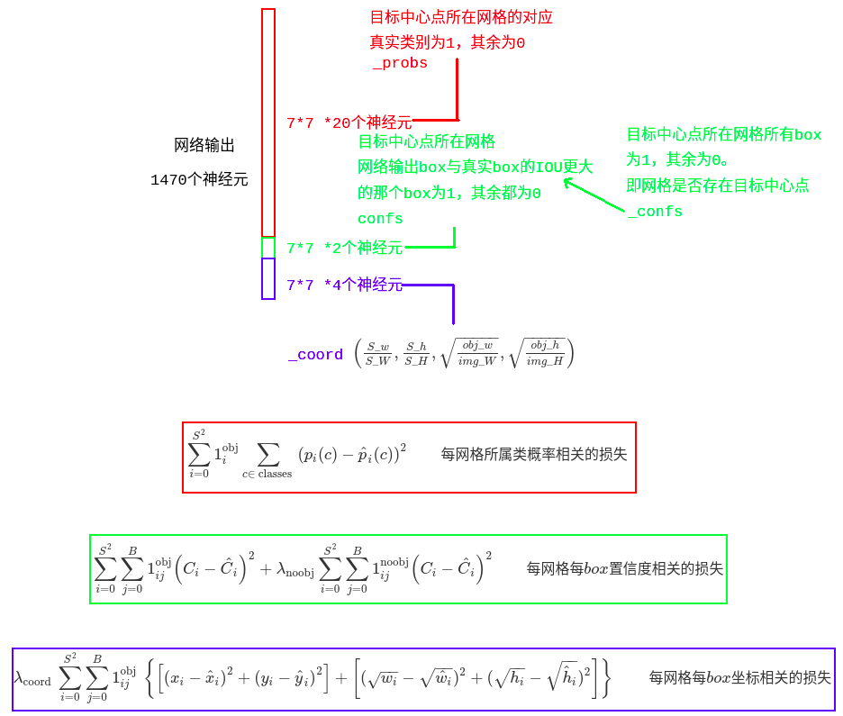
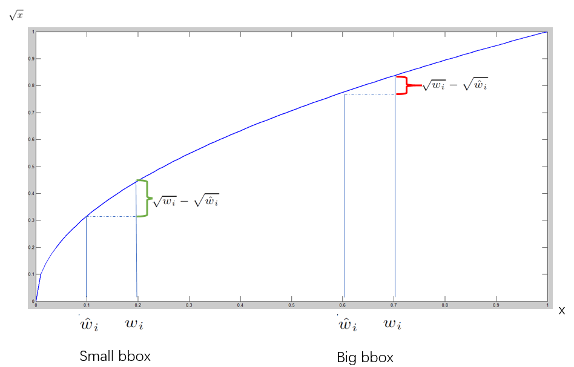

# YOLO v1
- [代码笔记](https://github.com/staillyd/darkflow/blob/master/note/info.md)
## 大体流程

1. resize成448\*448，图片切割成S\*S个网格，这里是7\*7。
2. CNN特征提取和预测，卷积部分负责特征提取，全连接层部分负责预测
3. nms过滤去重

## 网络设计

- 卷积层64x下采样
- 卷积层、池化层输入输出尺寸关系:$W_{out}=\frac{W_{in}+P_1+P_2-F}{S}+1$
  - $P_1、P_2$:两侧padding大小
  - $F$:核大小
  - $S$:步长
  - tf中有两种方式:
    - 'SAME':输出尺寸为$\frac{W}{S}$
    - 'VALID':输出尺寸为$\frac{W-F+1}{S}$
## 训练
- 训练方式
   1. 前20层卷积(从头到倒数第五个卷积结束)稍作修改的googleNet+1个maxpool+1个全连接层进行ImageNet分类预训练,得到权重,**卷积层的权重赋值给初始化时的对应层**
   2. 后4层卷积和2个全连接层,随机初始化权重

- 输入输出及标签

   - 输入为图片 448\*448\*3
   - 输出为S\*S\*(B\*5+C)的tensor,在PASCAL VOC中S=7,B=2,C=20,输出为7\*7\*30
   - 标签
     - 将图片分割为S*S个小网格,每个网格预测 B个bbox:($x_{center},y_{center},w,h$),B个confidence, C个类别概率。
     - 非物体中心点的网格对应标签都为0
     - 物体中心点的网格:
       - $x_{center},y_{center}$为中心点在当前网格坐标的归一化值。$w,h$为框在整幅图坐标的归一化值
       - confidence为1
       - 物体对应类别的概率为1,其他类别为0
  

- 实际应该是中心点所在网格，但由于在中心点绘制相对乱，因此在左上角绘制

- 损失函数
$\begin{aligned}
   & \lambda_{\text {coord }} \sum_{i=0}^{S^{2}} \sum_{j=0}^{B} \mathbb{1}_{i j}^{\text {obj }}\left[\left(x_{i}-\hat{x}_{i}\right)^{2}+\left(y_{i}-\hat{y}_{i}\right)^{2}\right]+\lambda_{\text {coord }} \sum_{i=0}^{S^{2}} \sum_{j=0}^{B} \mathbb{1}_{i j}^{\text {obj }}\left[\left(\sqrt{w_{i}}-\sqrt{\hat{w}_{i}}\right)^{2}+\left(\sqrt{h_{i}}-\sqrt{\hat{h}_{i}}\right)^{2}\right]\\
   \quad +& \sum_{i=0}^{S^{2}} \sum_{j=0}^{B} \mathbb{1}_{i j}^{\text {obj }}\left(C_{i}-\hat{C}_{i}\right)^{2}+\lambda_{\text {noobj }} \sum_{i=0}^{S^{2}} \sum_{j=0}^{B} \mathbb{1}_{i j}^{\text {noobj }}\left(C_{i}-\hat{C}_{i}\right)^{2}\\
   \quad +& \sum_{i=0}^{S^{2}} \mathbb{1}_{i}^{\text {obj }} \sum_{c \in \text { classes }}\left(p_{i}(c)-\hat{p}_{i}(c)\right)^{2}
\end{aligned}$

   - $\mathbb{1}_{i j}^{\text {obj }}$:第i个网格的第j个bbox是否负责这个目标。与目标bbox真值IOU最大的预测bbox负责该目标。
   - $\mathbb{1}_{i}^{\text {obj }}$:第i个网格是否存在目标
   - 更重视8维的坐标预测,给这些损失前面赋予更大的loss weight,记为$\lambda_{\text {coord }}$,在pascal VOC训练中取5
   - 对没有目标的bbox的confidence loss，赋予小的loss weight，记为$\lambda_{\text {noobj }}$,在pascal VOC训练中取0.5
   - 有object的bbox的confidence loss 和类别的loss 的权重正常取1

   - 如果采用$\lambda_{\text {coord }} \sum_{i=0}^{S^{2}} \sum_{j=0}^{B} \mathbb{1}_{i j}^{\text {obj }}\left[\left(x_{i}-\hat{x}_{i}\right)^{2}+\left(y_{i}-\hat{y}_{i}\right)^{2}\right]+\lambda_{\text {coord }} \sum_{i=0}^{S^{2}} \sum_{j=0}^{B} \mathbb{1}_{i j}^{\text {obj }}\left[\left(w_{i}-\hat{w}_{i}\right)^{2}+\left(h_{i}-\hat{h}_{i}\right)^{2}\right]$作为bbox loss，那么小目标与大目标相同的bbox loss在实际效果上看会造成更大的偏差，即相比于大目标可能会框不住小目标。因此，采用$\lambda_{\text {coord }} \sum_{i=0}^{S^{2}} \sum_{j=0}^{B} \mathbb{1}_{i j}^{\text {obj }}\left[\left(x_{i}-\hat{x}_{i}\right)^{2}+\left(y_{i}-\hat{y}_{i}\right)^{2}\right]+\lambda_{\text {coord }} \sum_{i=0}^{S^{2}} \sum_{j=0}^{B} \mathbb{1}_{i j}^{\text {obj }}\left[\left(\sqrt{w_{i}}-\sqrt{\hat{w}_{i}}\right)^{2}+\left(\sqrt{h_{i}}-\sqrt{\hat{h}_{i}}\right)^{2}\right]$作为损失。小目标 bbox的横轴值较小，发生偏移时，反应到y轴上的loss（上图绿色）比大目标 box(上图红色)要大。

## 测试
- 每个网格的类别概率*每个bbox的confidence作为**置信度得分**，既包含类别信息又包含bbox准确度的信息

## 缺陷：
- YOLO对相互靠的很近的物体（挨在一起且中点都落在同一个格子上的情况），还有很小的群体 检测效果不好，这是因为一个网格中只预测了两个框，并且只属于一类。
- 测试图像中，当同一类物体出现的不常见的长宽比和其他情况时泛化能力偏弱。
- 由于损失函数的问题，定位误差是影响检测效果的主要原因，尤其是大小物体的处理上，还有待加强。
