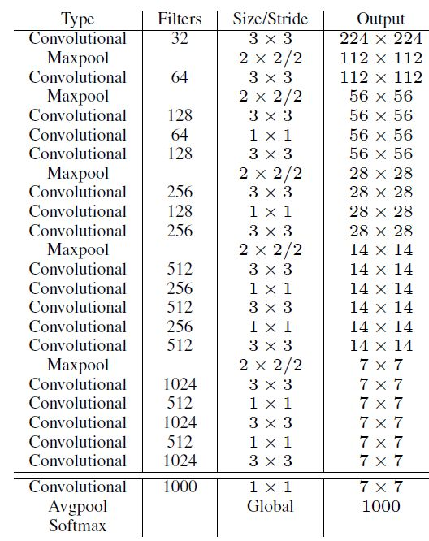

# YOLO v2
## 改进策略

### Batch Normalization
- 每个卷积层后添加Batch Normalization层，不再使用droput，YOLOv2的mAP提升了2.4%
### High Resolution Classifier
- YOLO v1预训练采用224x224图像输入得到的卷积层权重,YOLO v2采用448x448尺寸的图像进行预训练10 epochs，YOLOv2的mAP提升了约4%

### Convolutional With Anchor Boxes
- YOLOv2移除了YOLOv1中的全连接层而采用了卷积和anchor boxes来预测边界框(借鉴RPN)
- YOLOv2下采样x32,采用416x416大小作为网络输入,得到13x13的特征图,纬度为奇数,每个位置的各个anchor boxes都有独自的(x,y,w,h,c)
- mAP稍微下降,但YOLO v1只预测98个框(7\*7\*2),YOLO v2预测(13\*13\*num_anchor个框),召回率(查全率)从81%上升到87%

### Dimension Clusters
- YOLO v2采用k-means聚类方法对训练集中的边界框做了聚类分析
- 选用box与聚类中心box之间的IOU值作为距离指标
- 
- 综合考虑模型复杂度和召回率，最终选取5个聚类中心作为先验框

### New Network: Darknet-19
- 新的骨干网Darknet-19,mAP值没有显著提升，但是计算量却可以减少约33%
- 
- global avgpooling:代替全连接层,减小参数量,卷积输出的每个通道取均值得到一个值,然后输出到分类器

### Direct location prediction
- 
- 上图所有变量都是在特征图坐标下(13x13)，最终网络输出->解码得到归一化的$b_x,b_y,b_w,b_h$,见下文的**网络拟合**
- 预测边界框中心点相对于对应cell左上角位置的相对偏移值，**边界框的中心位置约束在当前cell内部**，防止偏移过多，模型更容易稳定训练。
- $c_x,c_y$:锚点坐标,左上角坐标
- 结合聚类分析得到先验框与边界框约束，YOLOv2的mAP值提升了约5%。

### Fine-Grained Features
- 输入416x416，经过5次maxpooling得到13x13的特征图，检测小目标用更精细的特征图会更好。
- 借鉴ResNet,将前一层更精细的26x26x512输入passthrough层，抽取输入层的2x2局部区域，将其转化为channel维度，变为13x13x2048.
- 使用Fine-Grained Features之后YOLOv2的性能有1%的提升。

### Multi-Scale Training
- YOLOv2模型中只有卷积层和池化层，所以YOLOv2的输入可以不限于416x416大小的图片
- 在训练过程，每隔10个iterations随机选择一种输入图片大小(32的倍数)，然后只需要修改对最后检测层的处理就可以重新训练。
- 
- 测试时不同输入的结果
  - 

## 训练方式
- 预训练:由于新网络darknet-19先用224x224进行ImageNet训练160轮。然后将输入变为448x448进行finetune(微调),训练10轮。
- 
  - 训练:移除darknet-19最后一个卷积层、global avgpooling以及softmax层,新添三个3x3x2014卷积层、1个passthrough、最后使用1x1卷积层输出预测结果。
  - 输出channel:num_anchor*(5+num_classs)

- 标签
  - 非物体中心点的网格对应标签都为0
  - 物体中心点的anchor:
    - 得到$\sigma(t_x),\sigma(t_y),t_w,t_h,class,confidence$
    - confidence为1
    - 物体对应类别的概率为1,其他类别为0
- **网络拟合**
  - $\sigma(t_x),\sigma(t_y),t_w,t_h,class,confidence$
  - 
    - 这里的$b_x,b_y,b_w,b_h$是**归一化后的结果**
    - $W,H$为特征图的尺度
  - 
- **损失**
  - 
  - $\mathbb{1}_{ij}^{obj}$:匹配原则，对于某个ground truth，先确定其中心点落在哪个cell，然后计算这个cell的5个先验框与ground truth的IOU值.**计算IOU值时不考虑坐标，只考虑形状**，先将先验框与ground truth的中心点都偏移到同一位置（原点），然后计算出对应的IOU值，IOU值最大的那个先验框与ground truth匹配，对应的预测框用来预测这个ground truth
  - $\mathbb{1}_{ij}^{noobj}$:匹配原则，预测框与所有ground truth框进行IOU计算，最大IOU值小于阈值的当作$noobj$
  - 对于那些没有与ground truth匹配的先验框（与预测框对应），除去那些Max_IOU低于阈值的，其它的就全部忽略，不计算任何误差
  - 在计算boxes的w和h误差时，YOLOv1中采用的是平方根以降低boxes的大小对误差的影响，而YOLOv2是直接计算，但是根据ground truth的大小对权重系数进行修正$(2 - b_wb_h)$,小框的权重相对更大
  - $\mathbb{1}_{t<12800}$:前12800次迭代。在训练前期使预测框快速学习到先验框的形状

## 测试
- 网络输出$\sigma(t_x),\sigma(t_y),t_w,t_h,class,confidence$,经过解码得到$b_x,b_y,b_w,b_h$(特征图尺度下归一化的坐标),在进行尺度变换得到原图的检测框

# YOLO 9000
- VOC数据集可以检测20种对象，但实际上对象的种类非常多，只是缺少相应的用于对象检测的训练样本。
- YOLO2尝试利用ImageNet非常大量的分类样本，联合COCO的对象检测数据集一起训练，使得YOLO2即使没有学过很多对象的检测样本，也能检测出这些对象。
- 基本的思路是，如果是检测样本，训练时其Loss包括分类误差和定位误差，如果是分类样本，则Loss只包括分类误差。
1. 构建WordTree
   - ImageNet的对象类别与COCO的对象类别不是互斥的,不适合用单个softmax来做对象分类，而是要采用一种多标签分类模型
   - YOLO2于是根据WordNet，人为将ImageNet和COCO中的名词对象一起构建了一个WordTree，以physical object为根节点，各名词依据相互间的关系构建树枝、树叶，节点间的连接表达了对象概念之间的蕴含关系（上位/下位关系）

   1. 检查每一个将用于训练和测试的ImageNet和COCO对象，在WordNet中找到对应的节点，如果该节点到WordTree根节点（physical object）的路径只有一条（大部分对象都只有一条路径），就将该路径添加到WrodTree
   2. 经过上面操作后，剩下的是存在多条路径的对象。对每个对象，检查其额外路径长度（将其添加到已有的WordTree中所需的路径长度），选择最短的路径添加到WordTree。这样就构造好了整个WordTree。
2. 一个WordTree对应且仅对应一个对象，该对象节点到根节点的所有节点概率都是1，体现出对象之间的蕴含关系，而其它节点概率是0
3. 预测:从根节点开始向下遍历，对每一个节点，在它的所有子节点中，选择概率最大的那个（一个节点下面的所有子节点是互斥的），一直向下遍历直到某个节点的子节点概率低于设定的阈值（意味着很难确定它的下一层对象到底是哪个），或达到叶子节点，那么该节点就是该WordTree对应的对象。输出路径概率乘积
4. 分类与联合训练
   - 由于ImageNet样本比COCO多得多，所以对COCO样本会多做一些采样（oversampling），适当平衡一下样本数量，使两者样本数量比为4:1。
   - YOLO9000依然采用YOLO2的网络结构，不过5个先验框减少到3个先验框，以减少计算量。YOLO2的输出是13\*13\*5\*(4+1+20)，现在YOLO9000的输出是13\*13\*3\*(4+1+9418)。假设输入是416\*416\*3。
   - 对一个检测样本，其分类误差只包含该标签节点以及到根节点的所有节点的误差.