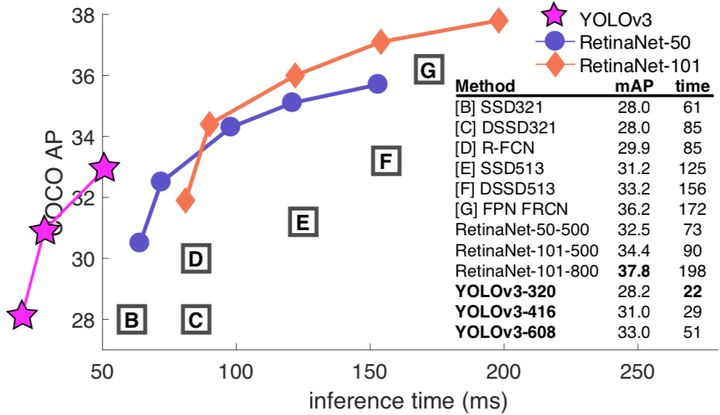
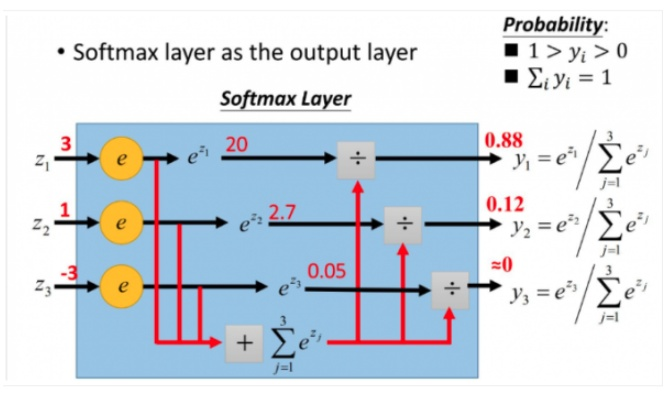
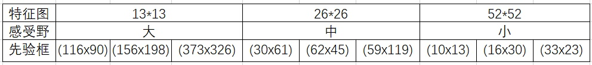
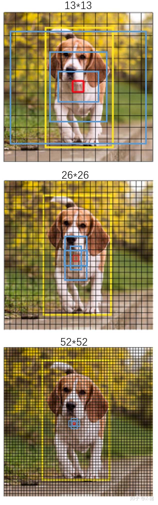
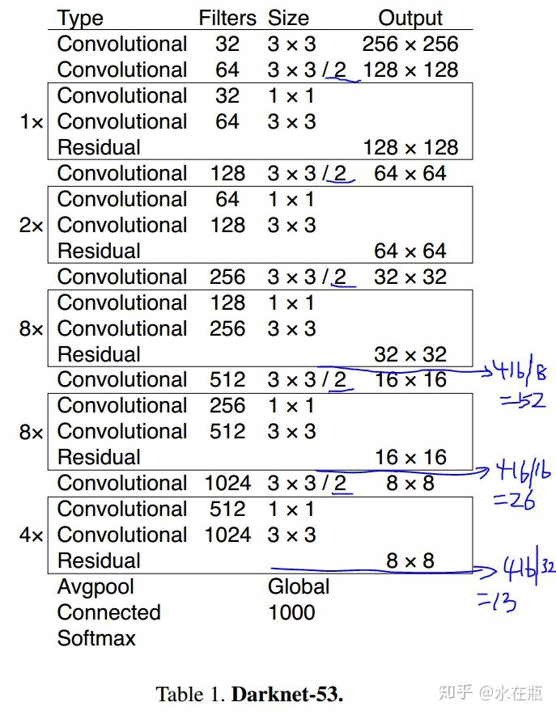
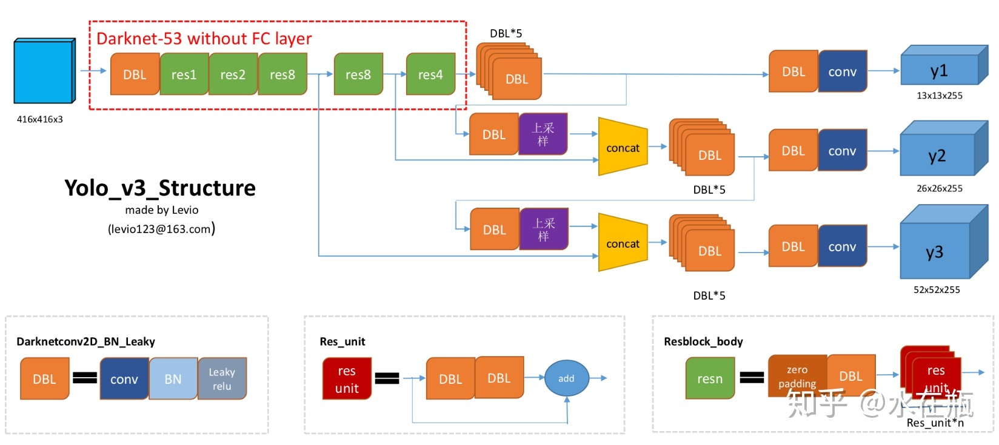
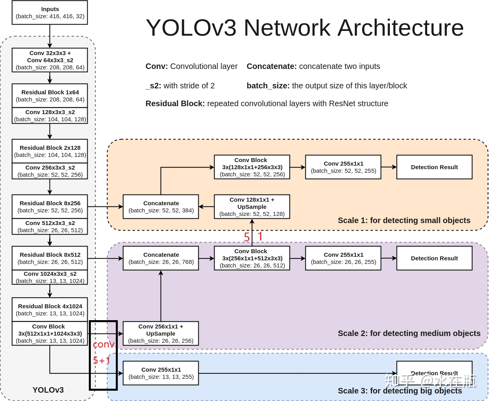

# YOLO v3

- 30ms左右

## 边界框回归
- 沿用YOLO v2

## 多类预测
- 多标签分类法
- 不用softmax,采用logistic回归,双向交叉熵损失
- 多标签采用softmax效果不好,softmax会使最可能的项数值远超过其他项
  - 

## 多尺度预测
- FPN
- 不同尺度的特征图对应的不同大小的anchor prior
- 
  - 

## Darknet 53

- 舍弃了maxpooling,用stride为2的卷积

## 无用
- 类似FasterRCNN的双阈值
- 正常的anchor box offfset预测
- $b_x,b_y$用线性函数
- Focal loss

## 网络结构

- 上采样方式:将一个像素转换为2x2区域中的4个像素

## 损失函数
- 将YOLO v2中类别损失转为二元交叉熵(softmax变为logistic)
  - 二元交叉熵,网络最后一层->sigmod->二元交叉熵$-(ylog(\hat{y})+(1-y)log(1-\hat{y}))$
    - 如果类别为真实类别$y=1,loss=-log(\hat{y})$
    - 如果类别不是真实类别$y=0,loss=-log(1-\hat{y})$
- [作者评论](https://github.com/pjreddie/darknet/issues/1354)
- [交叉熵](https://www.zhihu.com/question/65288314/answer/244557337)
  - KL散度，衡量两分布的不同.$D_{K L}(A|| B)=\sum_{i} P_{A}\left(x_{i}\right) \log \left(\frac{P_{A}\left(x_{i}\right)}{P_{B}\left(x_{i}\right)}\right)=\sum_{i} P_{A}\left(x_{i}\right) \log \left(P_{A}\left(x_{i}\right)\right)-P_{A}\left(x_{i}\right) \log \left(P_{B}\left(x_{i}\right)\right)$
  - 熵.$S(A)=-\sum_i P_A(x_i)logP_A(x_i)$
  - 交叉熵.$H(A,B)=-\sum_iP_A(x_i)log(P_B(x_i))$
  - $D_{KL}(A||B)=-S(A)+H(A,B)$
  - 训练数据的分布A是给定的，固定不变，那么$S(A)$为常量.求$D_{KL}(A||B)$等价于求$H(A,B)$
  