# YOLO v4
## Ref
- [**准备知识一**](https://zhuanlan.zhihu.com/p/139764729)
- [**准备知识二**](https://zhuanlan.zhihu.com/p/141533907)
  1. 数据增强相关
     1. **Random erasing data augmentation**:随机选择一个区域，然后采用随机值进行覆盖，模拟遮挡场景
     2. **Cutout**:随机选择一个固定大小的正方形区域，然后采用全0填充
     3. **Hide-and-Seek**:去掉一些区域，使得其他区域也可以识别出物体，增加特征可判别能力.采用整个数据集的均值来填充造成的影响最小
     4. **GridMask Data Augmentation**:与之前3篇对比,删除信息和保留信息之间要做一个平衡
     5. **object Region Mining with Adversarial Erasing**:通过迭代训练的方式不断挖掘不同的可判别区域，最终组合得到完整的分割结果。
        - 放在现在来看，做法其实超级麻烦。
        - 但是其也提供了一种思路：是否可以采用分类预测出来的cam，结合弱监督做法，把cam的输出也引入某种监督，在提升分类性能的同时，提升可判别学习能力。
     6. **mixup**:两张图片采用比例进行全图混合，label也需要混合
        - 考虑过三个或者三个以上的标签做混合，但是效果几乎和两个一样，而且增加了mixup过程的时间。
        - 当前的mixup使用了一个单一的loader获取minibatch，对其随机打乱后，mixup对同一个minibatch内的数据做混合。这样的策略和在整个数据集随机打乱效果是一样的，而且还减少了IO的开销。
        - 在同种标签的数据中使用mixup不会造成结果的显著增强
     7. **cutmix**:
        - 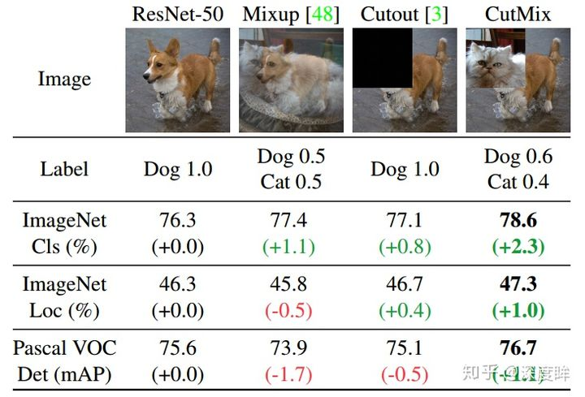
     8. **Stylized-ImageNet**:
        - CNN训练学习到的实际是纹理特征(texture bias)而不是形状特征
        - 将训练数据去除纹理特征(SIN)进行训练可以学习形状特征
        - SIN混合原始数据训练就可以实现既关注纹理，也关注形状，不仅符合人类直观，也可以提高各种任务的准确率和鲁棒性
     9. **label smooth**:对label进行soft操作，不要给0或者1的标签，而是有一个偏移，相当于在原label上增加噪声，让模型的预测值不要过度集中于概率较高的类别，把一些概率放在概率较低的类别。
     10. **mosic增强**:
         - 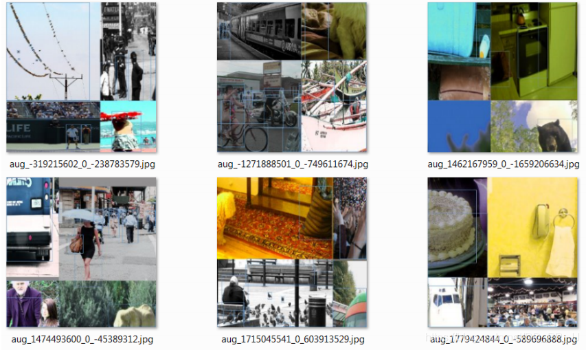
         - 将4张不同的图片镶嵌到一张图中
           - 混合四张具有不同语义信息的图片，可以让检测器检测超出常规语境的目标，增强模型的鲁棒性
           - 由于BN是从四张图片计算得到的，所以可以减少对大的mini-batch的依赖
  2. 特征增强相关
     1. **DropBlock**:
        - dropout方法多是作用在全连接层上，在卷积层应用dropout方法意义不大
        - 每个feature map的位置都有一个感受野范围，仅仅对单个像素位置进行dropout并不能降低feature map学习的特征范围，也就是说网络仍可以通过该位置的相邻位置元素去学习对应的语义信息，也就不会促使网络去学习更加鲁邦的特征
        - 在feature map上去一块一块的找，进行归零操作，类似于dropout，叫做dropblock
  3. BN改进:
     - 目的:解决当batch比较小时候，BN在batch维度统计不准确，导致准确率下降。
     1. **BN、GN、IN和LN**:使其不依赖batch
        - 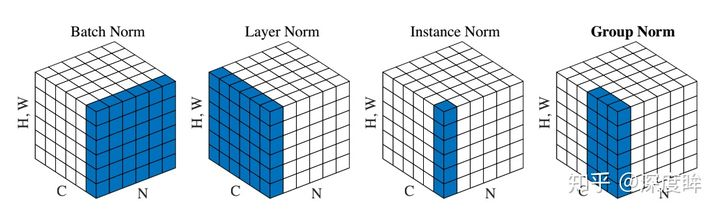
        - 假设输入维度是(N,C,H,W),不管哪一层归一化手段，都不会改变输出大小，即输出维度也是(N,C,H,W)
        - **BN**
          - 对于BN，其归一化维度是N、HxW维度，故其可学习权重维度是(C,)，其实就是BN的weight和bias维度，也就是论文中的$\gamma,\beta$
          - 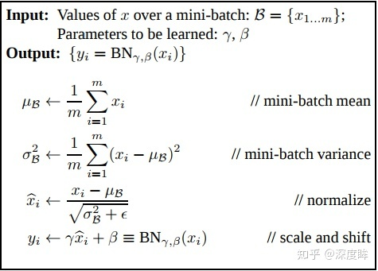
          - 在Batch和HxW维度进行归一化
          - 由于测试时候batch可能和训练不同，导致分布不一致，故还多了两个参数：全局统计的均值和方差值，从而eval模式是必须开的
          - 
          - 上述中C=100 其流程是：对batch输入计算均值和方差(N、H和W维度求均值)，得到维度为(C,)，然后对输入(N,C,H,W)采用计算出来的(C,)个值进行广播归一化操作，最后再乘上可学习的(C,)个权重参数即可
        - **LN**:
          - 其归一化维度是C、HxW维度或者HxW维度或者W维度，但是不可以归一化维度为H，可以设置，比较灵活，其对每个batch单独进行各自的归一化操作，归一化操作时候不考虑batch，所以可以保证训练和测试一样
          - ```python
            m = nn.LayerNorm(normalized_shape=[100 ,35 ,45])
            input = torch.randn(20, 100, 35, 45)
            ```
            可学习权重维度是(100,35,45)：对batch输入计算均值和方差(C、H和W维度求均值)，输出维度为(N,)，然后对输入(N,C,H,W)采用计算出来的(N,)个值进行广播归一化操作，最后再乘上可学习的(C,H,W)个权重参数即可。
        - **IN**:
          - 对batch输入计算均值和方差(H,W维度求均值方差)，输出维度为(N,C),然后对输入(N,C,H,W)采用计算出来的(N,C)个值进行广播归一化操作，最后再乘上可学习的(C,)个权重参数即可。
        - **GN**:
          - 对batch输入计算均值和方差(C/组数、H,W维度求均值方差)，输出维度为(N,组数),然后对输入(N,C,H,W)采用计算出来的(N,组数)个值进行广播归一化操作，最后再乘上可学习的(C,)个权重参数即可。
     2. **FRN**:使其不依赖batch
        - 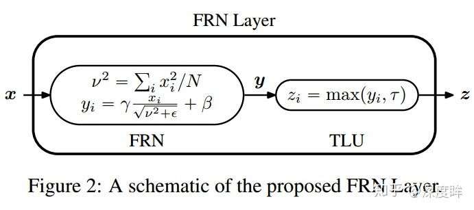
        - FRN:对输入的batch个样本在HxW维度上计算方差，不计算均值，得到输出维度(batch,c)，然后对(batch,c,h,w)进行除方差操作，并且引入可学习参数，权重维度是(C,),最后对上述输出乘以可学习参数即可输出。
        - TLU:由于在FRN操作中没有减去均值，会导致“归一化”后的特征值不是关于零对称，可能会以任意的方式偏移零值。如果使用ReLU作为激活函数的话，会引起误差，产生很多零值，性能下降。所以需要对ReLU进行增强，即TLU，引入一个可学习的阈值τ
        - 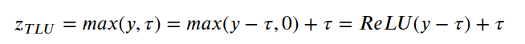
     3. **CBN**:在无法扩大batch训练的前提下，通过收集最近几次迭代信息来更新当前迭代时刻的均值和方差，变向扩大batch
        - 在当前迭代时刻，参数已经更新了N次，存储的前几个迭代的参数肯定无法直接和当前迭代次数进行合并计算，也就是由于网络权重的变化，不同迭代产生的网络激活无法相互比较
        - 由于梯度下降机制，模型训练过程中相近的几个iter所对应的模型参数的变化是平滑的（smoothly），其权重变化可以用泰勒级数拟合出来，因此通过基于泰勒多项式的拟合来补偿网络权重的变化，从而可以准确地估计统计量，并可以有效地应用批次归一化。
        - 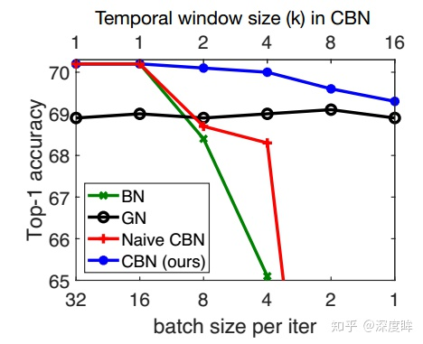
        - ResNet-18在ImageNet上面训练得到的top 准确率
        - 当batch大于16后，BN的精度就蛮好了，随着batch减少，精度快速下降，GN虽然性能还可以，但是batch大的时候精度不如BN，而Naive版本的CAN效果其实和BN差不多，**Naive版本是指收集最近K个迭代信息，然后用于计算当前迭代时刻的统计量，可以发现由于梯度更新原因，直接计算统计量其实没有效果，而本文的CBN可以比较好的克服。**
        - CBN多了一个window size，实验中设定为8。并且需要在网络训练初期要用较小的窗大小，随着网络的训练，模型参数也会越来越稳定，再用较大的窗大小可以获得更好的结果。
     4. **CmBN**:
        - 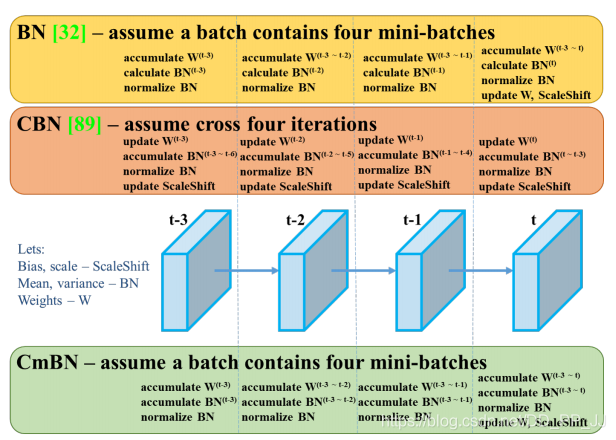
        - 假设迭代4次算一个大batch,即batch/mini batch=4
        - accumulate $W^t$:在第t时刻对梯度进行累积(梯度不清0的累加)
        - calculate $BN^t$:计算第t时刻的BN统计量，主要是均值和方差
        - normalize BN:BN的前向过程
          - 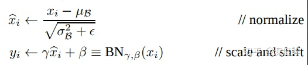
        - **橙色流程**:网络前向batch/ mini batch次，然后再第N-1迭代时刻进行统一的梯度更新，包括更新权重W以及BN可学习参数$\gamma,\beta$
        - **CBN**:CBN由于在计算每个迭代时刻统计量时候会考虑前3个时刻的统计量，故变相实现了大batch，然后在每个mini batch内部，都是标准的BN操作即:1 计算BN统计量;2 应用BN;3 更新可学习参数和网络权重
        - **CmBN**是CBN的变种(绿色部分)，在计算第t时刻的BN统计量时候，CBN会考虑前一个mini batch内部的统计量，而CmBN版本，所有计算都是在mini batch内部
        - 在消融实验中，CmBN要比BN高出不到一个百分点。影响不是很大。
  4. **网络改进**
     1. **增加感受野技巧**
        - **SPP层**
          - 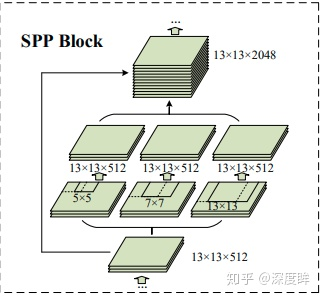
          - 内部采用不同大小的kernel size和strdie的maxpool实现不同感受野特征输出，然后concat即可
        - **ASPP**
          - 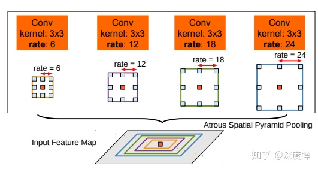
          - 采用卷积实现，且其kernel size全部是3，但是引入了不同的空洞率来变相扩大感受野。
        - **RFB**
          - 采用了不同大小的kernel和不同的空洞率，相比ASPP，计算量减少不少，效果应该差不多
     2. **注意力机制技巧**
        - **SE**
          - 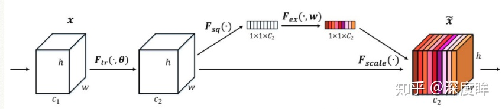
          - 目的是对特征通道进行重新加权
          - 提升大概1%的ImageNet top-1精度，增加2%计算量，但推理时有10%的速度损失，对GPU不太友好
        - **SAM**:空间注意力模块
          - 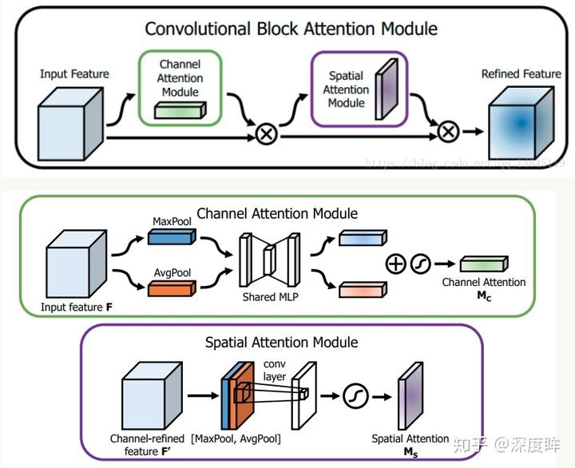
          - 将Channel attention模块输出特征图作为本模块的输入特征图
          - 首先做一个基于channel的global max pooling 和global average pooling，然后将这2个结果基于channel 做concat操作。然后经过一个卷积操作，降维为1个channel。再经过sigmoid生成spatial attention feature。最后将该feature和该模块的输入feature做乘法，得到最终生成的特征。
          - 增加0.1%计算量，提升0.5%的ImageNet top-1准确率
        - **Modified SAM**
          - 
     3. **特征融合技巧**
        - **FPN**
          - 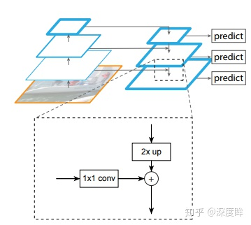
          - 融合相邻层的特征图，采用上采样或者下采样操作得到尺度一致的特征图，然后采用add操作得到融合后特征图。
        - **PAN**
          - 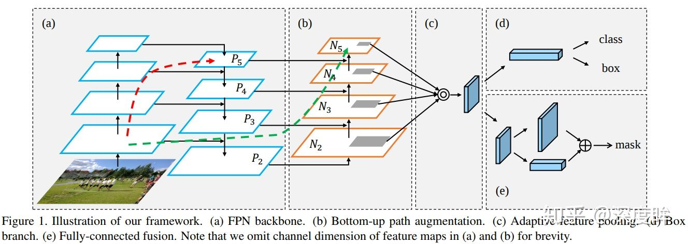
          - 添加了N2-N5,(b)部分
          - 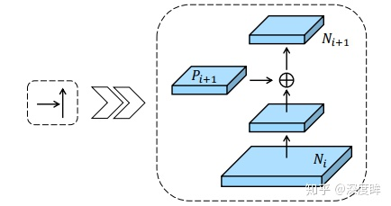
        - **SFAM**
          - 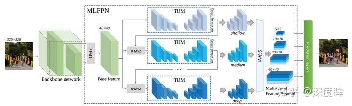
          - 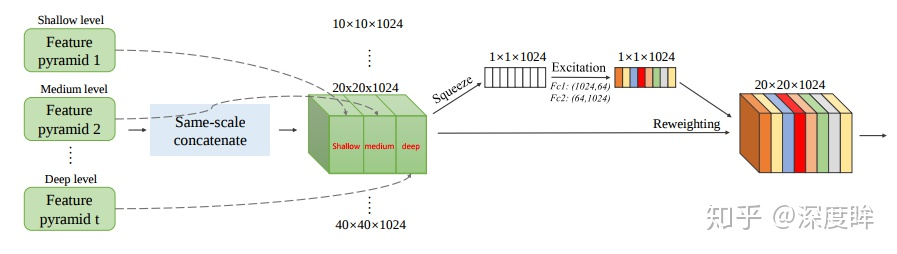
          - 对不同TUM的输出（每个TUM有6个不同尺度的输出），将其中相同尺度的特征进行concat，然后经过一个SE模块（对通道进行reweighting）输出，然后进行检测
        - **ASFF**
          - 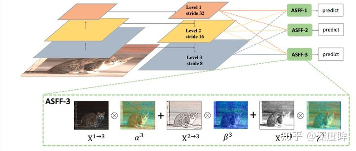
          - FPN这种concat或者add的融合方式不够科学。本文觉得应该自适应融合，自动找出最合适的融合特征
          - 原来的FPN add方式现在变成了add基础上多了一个可学习系数，该参数是自动学习的，可以实现自适应融合效果，类似于全连接参数
        - **BIFPN**
          - 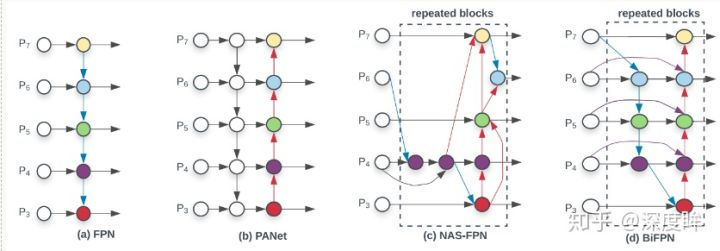
        - **modified PAN**
          - 
  5. **预测部分**
     1. IOU Loss
        - 评价指标使用了IOU，而回归坐标框又使用4个坐标变量，这两者是不等价的
        - 
        - 存在问题
          - 
          - 状态1:IOU=0，无法反应两个框距离的远近，Loss不可导
          - 状态2、3:当两个预测框大小相同，两个IOU也相同，IOU_Loss无法区分两者相交情况的不同。
     2. GIOU Loss
        - 
        - 存在问题
          - 
          - 状态1、2、3都是预测框在目标框内部且预测框大小一致的情况，这时预测框和目标框的差集都是相同的，因此这三种状态的GIOU值也都是相同的，这时GIOU退化成了IOU，无法区分相对位置关系
     3. DIOU Loss
        - 
        - 存在问题
          - 
          - 没有考虑长宽比
     4. CIOU Loss
        - $$CIOU\_Loss=1-CIOU=1-(IOU-\frac{Distance\_2^2}{Distance\_C^2}-\frac{v^2}{1-IOU+v})$$
        - $$v=\frac{4}{\pi^2}(arctan\frac{w^{gt}}{h^{gt}}-arctan\frac{w^p}{h^p})^2$$
     5. DIOU NMS
        - 
        - 在NMS的时候由于没有gt所以用的是DIOU
     6. 余弦退火学习率 


## YOLO v4导图
- 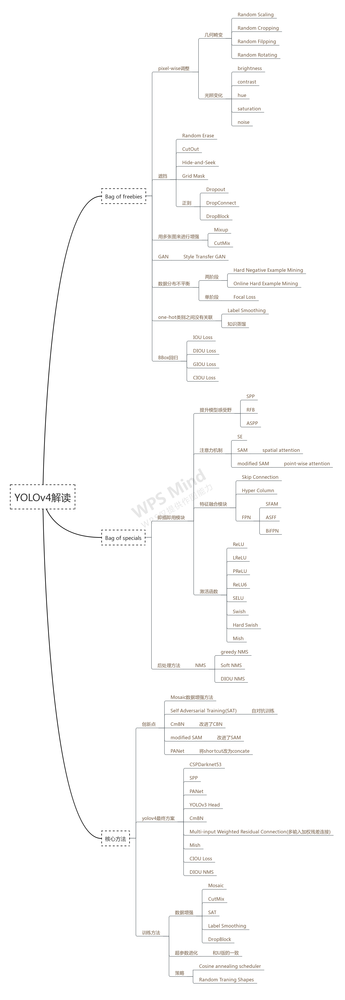
## 创新点
### Mosaic增强
- 见上方
### 自对抗训练SAT
- 第一阶段，CNN通过反向传播改变图片信息，而不是改变网络权值。通过这种方式，CNN可以进行对抗性攻击，改变原始图像，造成图像上没有目标的假象。
- 第二阶段，对修改后的图像进行正常的目标检测。
### CmBN
- 见上方
### Modified SAM
- 见上方

## 网络结构
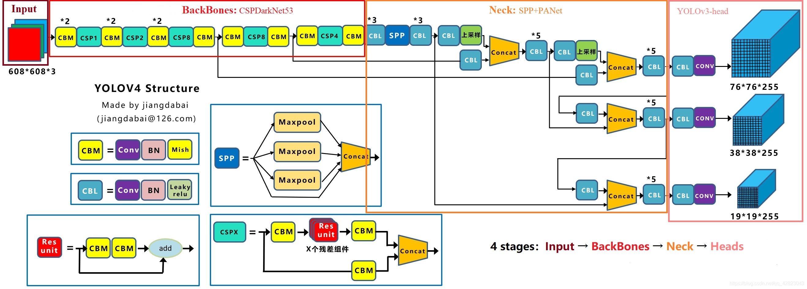
- CSPDarkNet53内激活函数为Mish
  - 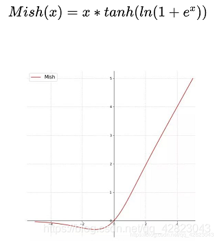