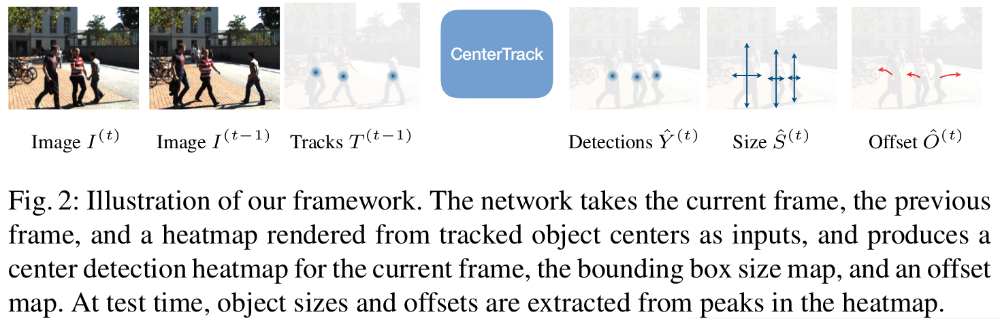

## 贡献
1. 构建了一个更简单，更快，更精确的目标检测与追踪联合算法
2. 可以轻松扩展到3D跟踪

## 任务描述
- 当对象离开图片或者被遮挡后重新出现,分配新的ID。(不解决遮挡问题)
- 输入当前帧图像$I^{(t)} \in \mathbb{R}^{W \times H \times 3}$,上一帧图像$I^{(t-1)} \in \mathbb{R}^{W \times H \times 3}$,和上一帧的检测跟踪结果$T^{(t-1)}=\left\{b_{0}^{(t-1)}, b_{1}^{(t-1)}, \ldots\right\}$
  - 每个目标$b=\left(\mathbf{p},\mathbf{s},w,id \right)$
    - 中心点位置:$\mathbf{p}\in \mathbb{R}^2$,对应下图的$\hat{Y}^{(t)}$
    - 目标size:$\mathbf{s}\in \mathbb{R}^2$
    - 置信度:$w \in \mathbb{I}$
    - 跟踪id:$id$
- 期望输出当前帧的检测结果$T^{(t)}=\left\{b_{0}^{(t)}, b_{1}^{(t)}, \ldots\right\}$,并为出现在两帧中的对象分配一个一致的ID

## 方案
### Tracking-conditioned detection
- 直接用CenterNet作为检测器无法检测到当前帧中被完全遮挡的目标,并且与时间无关,因此在CenterTrack中采用当前帧图像$I^{(t)}$和上一帧图像$I^{(t-1)}$,使网络估计场景中的变化,并可能从上一帧图像中恢复当前帧被遮挡的目标

- 输出一组与时间相关的检测对象

### Association through offsets
- 在Fig. 2中除了输出$\mathbf{p},\mathbf{s}$,还输出了偏移量$\hat{D}=\mathbb{R}^{\frac{W}{R} \times \frac{H}{R} \times 2}$,(在图中为$\hat{O}^{(t)}$),损失定为
  - $L_{off}=\frac{1}{N} \sum_{i=1}^N \left| \hat{D}_{\mathbf{p}_i^{(t)}} - \left( \mathbf{p}_i^{(t)} -\mathbf{p}_i^{(t-1)} \right)\right|$
    - $\mathbf{p}_i^{(t)}$:当前帧的目标中心点真值
- 对于每个当前帧的检测中心点$\hat{\mathbf{p}}^{(t)}$,根据预测得到的偏移量得到上一帧的预测中心点$\hat{\mathbf{p}}^{(t)}-\hat{D}_{\hat{\mathbf{p}}^{(t)}}$,通过上一帧检测的中心点$\hat{\mathbf{p}}^{(t-1)}$与预测得到的中心点$\hat{\mathbf{p}}^{(t)}-\hat{D}_{\hat{\mathbf{p}}^{(t)}}$按照置信度降序排列,进行最近匹配,如果预测得到的中心点$\hat{\mathbf{p}}^{(t)}-\hat{D}_{\hat{\mathbf{p}}^{(t)}}$周围半径$k$内没有之前检测跟踪的目标,则新生成一条轨迹.