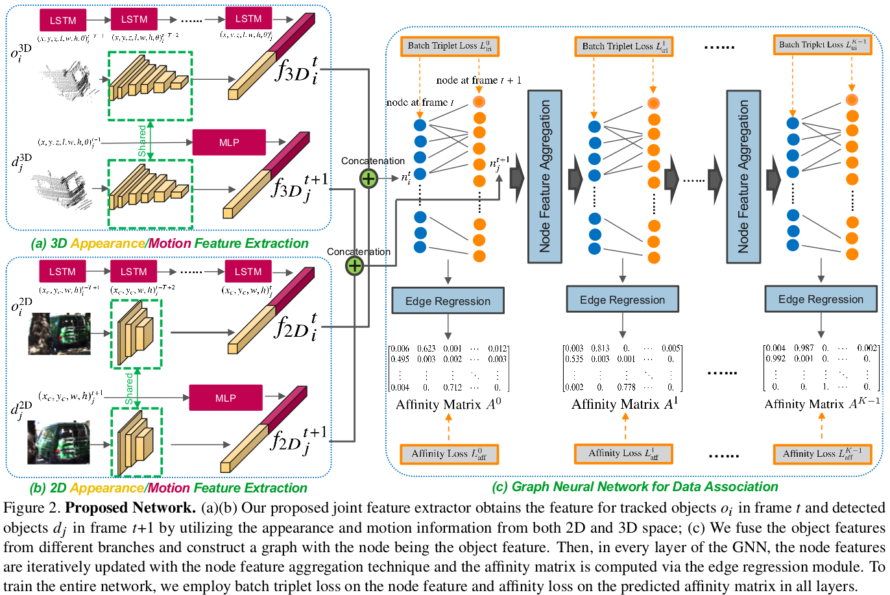
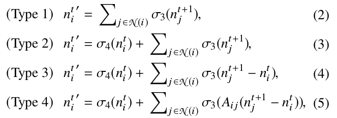

### GNN3DMOT: Graph Neural Network for 3D Multi-Object Tracking with Multi-Feature Learning
#### 创新点和贡献
1. 引入了GNN

- 以前的工作常常是根据每个对象进行独立的特征提取，然后每帧之间进行对象关联
- 而这里采样的对象特征提取的方法是结合了2D和3D的，并且是一种特征交互机制，简单来说，不是单独获得每一个目标的特征，而是将对象特征之间进行关联，也就是单个特征会被告知（attention）至其他对象特征，这样会使每一个对象特征会倾向于与它相似的对象的特征，反之不相似则远离，而2D和3D的跨模态则会使特征之间互补增强

- 边初始为度量节点相似度的指标,如余弦相似度
- 节点聚合(和[MPNTrack](MPNTrack.md)有区别)
  - 尝试了4种方式
  - 
- $A$:亲和力矩阵,分配矩阵