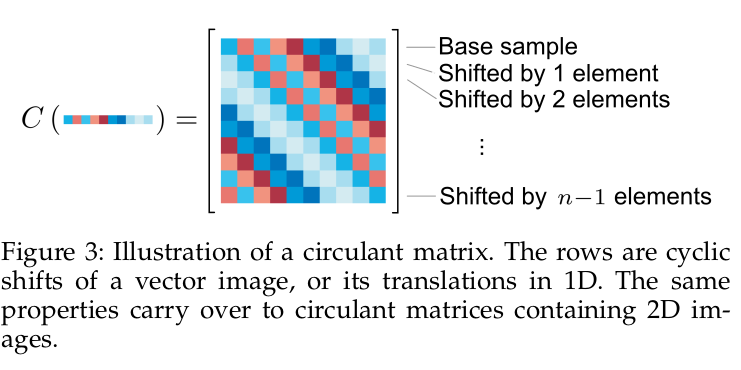
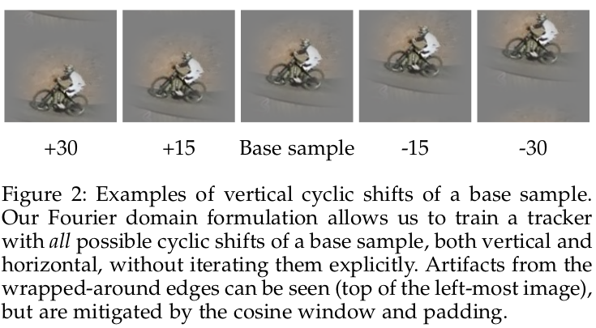
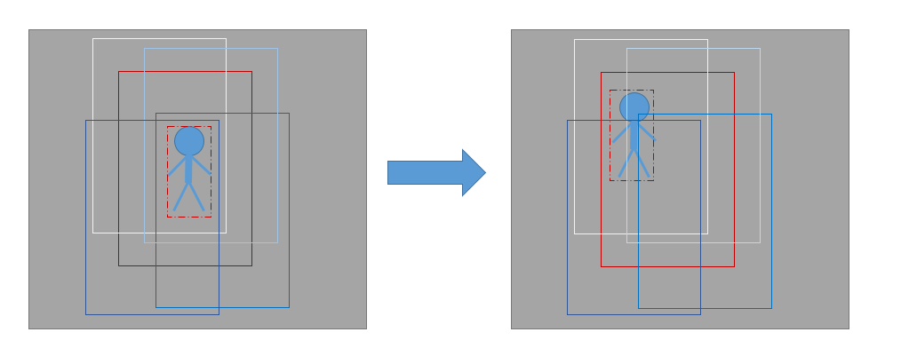
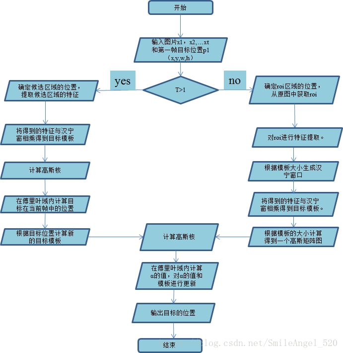
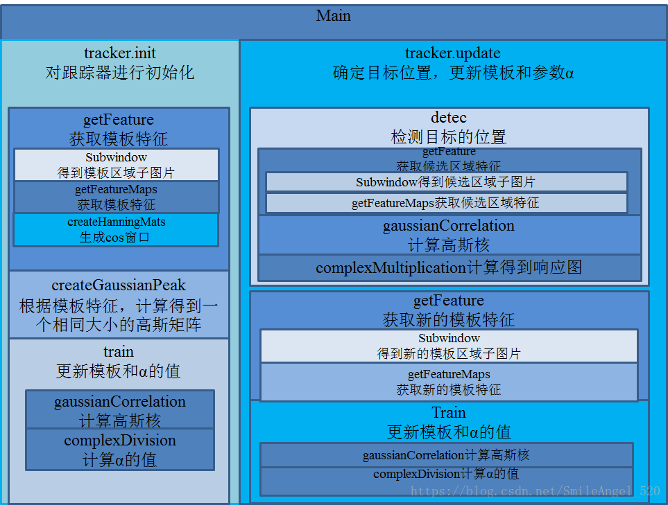
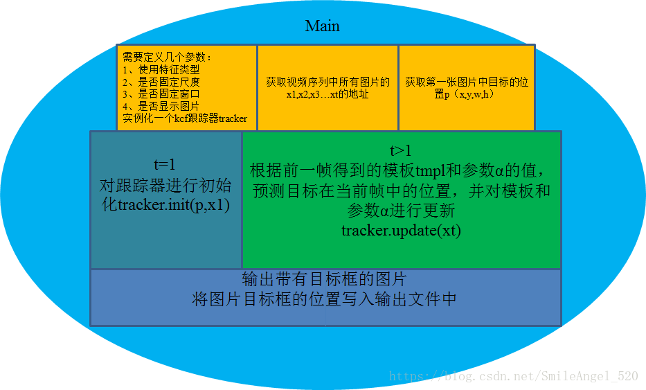
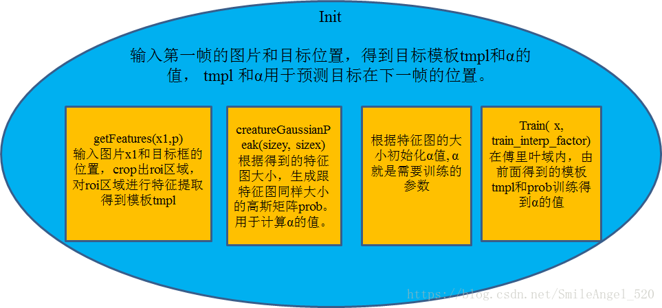
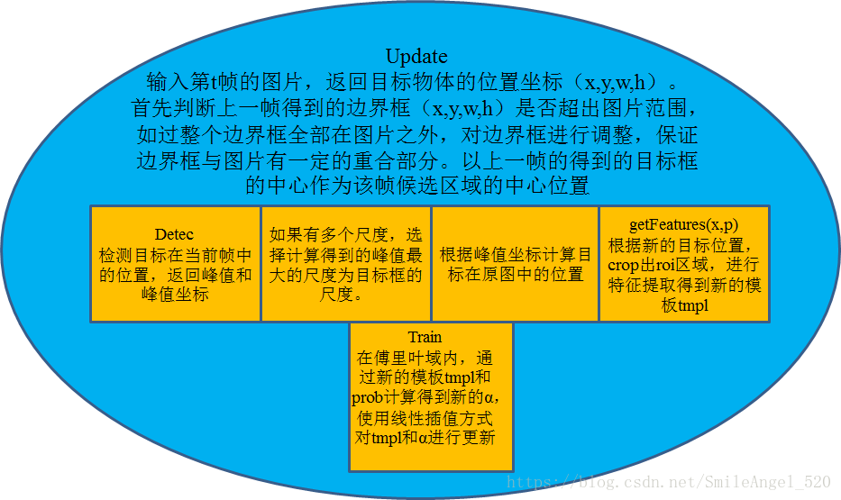
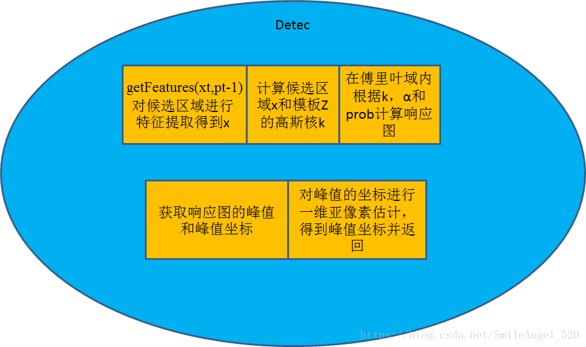

# KCF——2014
- [论文翻译](https://blog.csdn.net/weixin_39467358/article/details/83304082)
- 介绍
  - KCF是一种鉴别式追踪方法，这类方法一般在追踪过程中训练一个目标检测器，使用目标检测器去检测下一帧预测位置是否是目标，然后再使用新检测结果去更新训练集进而更新目标检测器。
  - 在训练目标检测器时一般选取目标区域为正样本，目标的周围区域为负样本，**越靠近目标的区域为正样本的可能性越大**。
- 贡献
  - 用目标周围区域的**循环矩阵**采集正负样本，利用岭回归训练目标检测器，并利用**循环矩阵在傅里叶空间可对角化**的性质将矩阵的运算转化为向量的Hadamad积，即元素的点乘，大大降低了运算量，提高了运算速度，使算法满足实时性要求。
  - 将线性空间的岭回归通过核函数映射到非线性空间，在非线性空间通过求解一个对偶问题和某些常见的约束，同样可以用循环矩阵傅里叶空间对角化简化计算。
  - 给出了一种将多通道数据融入该算法的途径。

- 循环移位
  - 定义x (base sample): 目标所在 子图像(patch) 的(n,1)维向量
    - $x=\begin{bmatrix}
      x_1\\x_2\\ \vdots \\x_n
    \end{bmatrix}$
  - Our goal is to train **a classifier** with both the **base sample** (a positive example) and **several virtual samples obtained by translating it** (which serve as negative examples).
  - 通过左乘置换矩阵对X进行行的循环位移
    - $P=\left[\begin{array}{ccccc}
            0 & 0 & 0 & \cdots & 1 \\
            1 & 0 & 0 & \cdots & 0 \\
            0 & 1 & 0 & \cdots & 0 \\
            \vdots & \vdots & \ddots & \ddots & \vdots \\
            0 & 0 & \cdots & 1 & 0
        \end{array}\right]$
    - 对X进行一次循环位移
      - $Px=\begin{bmatrix}
      x_n\\x_1\\x_2\\ \vdots \\x_{n-1}
    \end{bmatrix}$
    - 对X进行两次循环位移
      - $P^2x=\begin{bmatrix}
      x_{n-1}\\x_n\\x_1\\ \vdots \\x_{n-2}
    \end{bmatrix}$
    - 一维所有循环位移组成的矩阵$X=C(x)=\left\{P^ux|u=0,\cdots n-1\right\}$
      - 
      - 在本文中，将前半部分看作正向移动，后半部分看作负向移动
  - 通过右乘置换矩阵可以进行列的循环位移
    - $Q=\left[\begin{array}{ccccc}
            0 & 0 & 0 & \cdots & 1 \\
            1 & 0 & 0 & \cdots & 0 \\
            0 & 1 & 0 & \cdots & 0 \\
            \vdots & \vdots & \ddots & \ddots & \vdots \\
            0 & 0 & \cdots & 1 & 0
        \end{array}\right]$
  - 对于一幅图像img，通过左乘P进行行循环位移，通过右乘Q进行列循环位移，$P^uimgQ^v$
    - 
- 循环矩阵
  - $X=C(\mathbf{x})=\left[\begin{array}{ccccc}
                      x_{1} & x_{2} & x_{3} & \cdots & x_{n} \\
                      x_{n} & x_{1} & x_{2} & \cdots & x_{n-1} \\
                      x_{n-1} & x_{n} & x_{1} & \cdots & x_{n-2} \\
                      \vdots & \vdots & \vdots & \ddots & \vdots \\
                      x_{2} & x_{3} & x_{4} & \cdots & x_{1}
                    \end{array}\right]$
  - 所有循环矩阵可以在傅氏空间中使用离散傅立叶矩阵进行对角化，详细见[参考](https://blog.csdn.net/shenxiaolu1984/article/details/50884830)
    - $X=F \operatorname{diag}(\hat{\mathbf{x}}) F^{H}$
      - 离散傅里叶矩阵$F=\frac{1}{\sqrt{K}}\left[\begin{array}{cccc}
                          1 & 1 & 1 & 1 \\
                          1 & \omega & \omega^{2} & \omega^{3} \\
                          1 & \omega^{2} & \omega^{4} & \omega^{6} \\
                          1 & \omega^{3} & \omega^{6} & \omega^{9}
                      \end{array}\right]$
        - $K$:原向量x的长度，循环矩阵(K,K)
        - $\omega=e^{-2 \pi i / K}$
      - 信号的傅立叶变换可以通过F求
        - $\hat{x}=D F T(x)=\sqrt{K} \cdot F \cdot x$
- 流程
  - 大体流程[博客](https://www.cnblogs.com/YiXiaoZhou/p/5925019.html)
    - 
      - 左图是刚开始用红色虚线框框定了目标，红色实线框使用padding，其他的框是将padding循环移位之后对齐目标得到的样本(这是为了理解，实际中不用对齐)由这些样本就可以训练出一个分类器
      - 右图:下一帧图像，上一帧的padding作为预测区域(红色实线框)，然后对该区域进行循环移位，对齐目标后就如像图中显示的周围框(实际不用对齐)，使用分类器对这些框框计算响应，(分类器好的情况下)人在中心的白色框响应最大，通过白色框的相对移位推测目标的位移
      - 然后根据白色框循环移位进行训练再检测。。。。
  - 细节
    - 对特征图像进行cosine window加权，这主要是为了减轻由于边界移位导致图像不光滑。
    - padding的size是目标框的2.5倍
    - 对于标签使用了高斯加权，越靠近目标的区域为正样本的可能性越大
    - 对$\alpha$前后帧结果进行了线性插值，不至于模型剧烈变化

  - 没看代码，这是[博客](https://blog.csdn.net/SmileAngel_520/article/details/79955273)上的总结部分，可能细节和代码有出入，但逻辑应该差别不大。
    - 
    - 
    - 
    - 
    - 
    - 
  