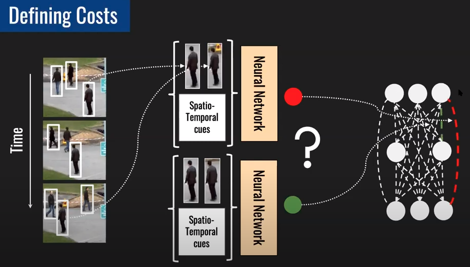
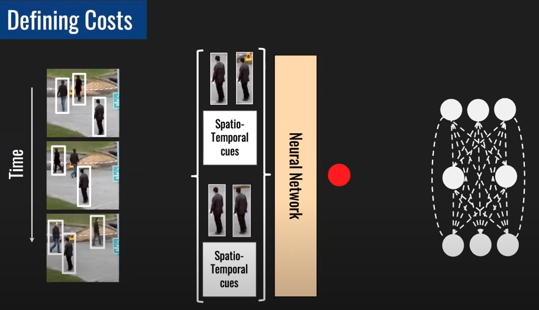
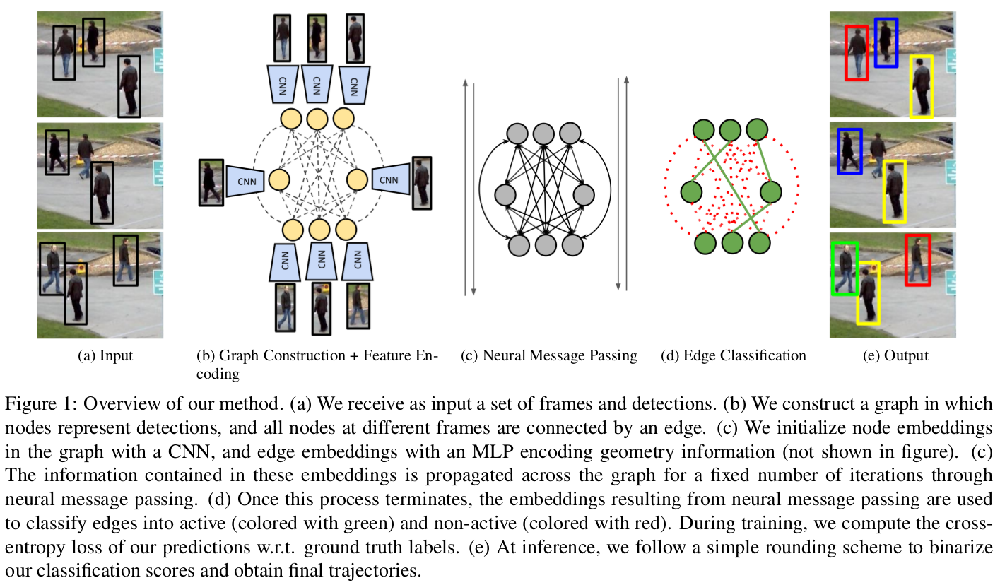
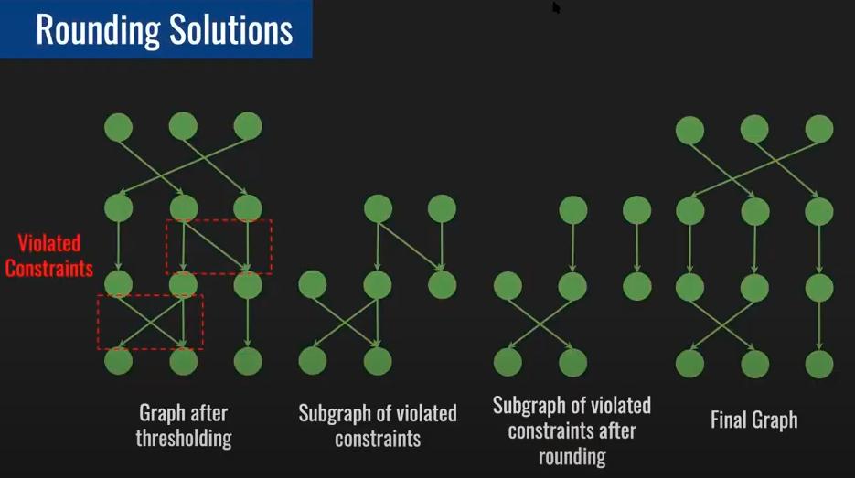
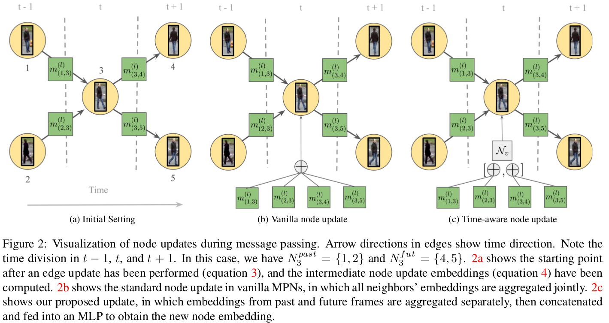
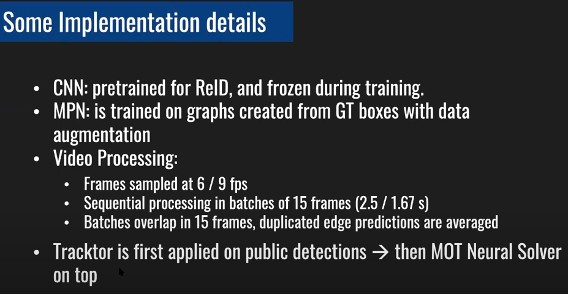

### Learning a Neural Solver for Multiple Object Tracking
#### 创新点与贡献
1. 提出了基于信息传递网络的MOT求解器,利用问题的网络图结构学习特征并给予最终解决方案.
2. 基于MOT的经典最小成本流,提出了一种新颖的具有time-aware的神经信息传递更新步骤.

#### 问题描述
##### 定义
- $\mathcal{O}=\left\{ o_1, \dotsb , o_n \right\}$,$n$:视频中所有帧里的检测目标总数.
  - $o_i=\left( a_i,p_i,t_i \right)$
    - $a_i$:bbox里的原始像素值
    - $p_i$:bbox
    - $t_i$:时间戳
- 构造无向图:$G=(V,E)$
  - $V :=\{1,\dotsb,n\} $:每个节点$i$代表一个$o_i$
  - $E \subset V \times V$
- 具有时间顺序的轨迹$T_i=\left\{ o_{i_1},\dotsb ,o_{i_{n_i}} \right\}$
  - $n_i$:$T_i$里的检测目标个数
- 边(两个顶点)是否在轨迹中
$y_{(i,j)}:= \left\{
        \begin{aligned}
            &1 \qquad \exists T_k \in T_{\ast} \quad s.t. (i,j)\in T_k \\
            &0 \qquad otherwise.
        \end{aligned}
        \right .$
##### 目标
- 找到$T_{\ast}=T_1,\dotsb,T_m$

##### 约束方式求解(NP问题)

- 边代表成本,用神经网络拟合
- 对于外观不像的期望输出高的cost,对于外观像的期望输出低的cost

- 但是,当前帧目标对于不同帧的同一个目标用之前的输出则会基本一致,不好确定当前帧目标与哪帧相连,(一个顶点不出现在多于1条轨迹中,而且期望轨迹是时间顺序的)

- 因此期望,输入两组数据,用一个更高阶的拟合器来输出cost
- 这样高阶得到的特征在优化上很难求解,二次整数约束

$ \mathbf{min}_y \qquad \sum_{(i,j) \subset E} c(i,j)y(i,j) \\
\mathbf{Subject \ to}: \left\{
            \begin{aligned}
                \sum_{(j,i)\in E s.t. t_i>t_j} y(j,i) \leq 1 \\
                \sum_{(i,k)\in E s.t. t_i<t_k} y(i,k) \leq 1 \\
                y_{(i,j)}\in \{0,1\}, \quad (i,j)\in E
            \end{aligned}
        \right . \\
$
- 一个顶点不出现在多于1条轨迹中
$ \left\{
\begin{aligned}
    \sum_{(j,i)\in E s.t. t_i>t_j} y(j,i) \leq 1 \\
    \sum_{(i,k)\in E s.t. t_i<t_k} y(i,k) \leq 1
\end{aligned}
\right .$
- 直接求解耗时高,需要多项式时间

#### 方案

1. 给定视频中的对象检测,构建一幅图,节点对应于检测框,边对应于节点之间的连接
2. 将检测框里的图像当作CNN输入,CNN输出节点外观embedding.边界框相对大小、位置、时间距离作为输入向量输入到MLP,MLP输出边的几何embedding.
3. 在图中执行一系列的消息传递步骤,每轮消息传递,节点与其连接边共享外观信息,而边缘与入射节点共享几何信息.
4. 使用最终的边的embedding进行$y_{(i,j)}$的二分类

- 后处理,将违反约束的边删去

#### Message Passing Networks

- 定义
  - $h_i^{(0)}$:节点的embedding
  - $h_{(i,j)}^{(0)}$:边的embedding
  - $\mathcal{N}_v,\mathcal{N}_e$:learnable functions,CNN,MLPs

- message passing steps,固定迭代L次,$l \in \{1,\dotsb,L \}$,这里的L类似感受野
  - 节点到边的更新,边根据上一次迭代后的邻接节点embedding和当前边embedding进行聚合,然后扔到网络中,$(v\to e) \quad h_{(i,j)}^{(l)}=\mathcal{N}_e([h_i^{(l-1)},h_j^{(l-1)},h_{(i,j)}^{(l-1)}])$
  - 边到节点的更新,$(e\to v)$
    1. 邻接边和当前节点embedding聚合,扔到网络中,$m_{(i,j)}^{(l)}=\mathcal{N}_v([h_i^{(l-1)},h_{(i,j)}^{(l)}])$
    2. 将所有1的输出进行一次$\Phi$操作,$\Phi$包括均值、最大值、平均值等操作,$h_i^{(l)}=\Phi(\{ m_{(i,j)}^{(l)}\}_{j\in N_i})$

- **改变了信息传递的更新方式**,原来是将所有邻近的embedding汇总到一起,本文将过去和将来帧的embedding分开嵌入
  - 对于节点i,将过去、现在的节点分别定义为$N_i^{fut},N_i^{past}$,将过去、现在的边到节点的learnalbe function分为两个MLPs,记为$\mathcal{N}_v^{fut},\mathcal{N}_v^{past}$
  - $m_{(i,j)}^{(l)}=\left\{ \begin{aligned}
    &\mathcal{N}_v^{past}([h_i^{(l-1)},h_{(i,j)}^{(l)},h_{(i)}^{(0)}]) \quad if \ j\in N_i^{past} \\
    &\mathcal{N}_v^{fut}([h_i^{(l-1)},h_{(i,j)}^{(l)},h_{(i)}^{(0)}]) \quad if j \in N_i^{fut}
  \end{aligned} \right .$
  - $\begin{aligned}
    &h_{i,past}^{(l)}=\sum_{j \in N_i^{past}} m_{(i,j)}^{(l)}  \\
    &h_{i,fut}^{(l)}=\sum_{j \in N_i^{fut}} m_{(i,j)}^{(l)}
  \end{aligned}$

  - 最终聚合$h_{i,past}^{(l)},h_{i,fut}^{(l)}$,扔到最后一个MLP中,$h_i^{(l)}=\mathcal{N}_v([h_{i,past}^{(l)},h_{i,fut}^{(l)}])$
#### 特征编码
- 外观Embedding,$\mathcal{N}_v^{env}$,一个CNN,输入patch:$a_i$来获取特征,$h_i^{(0)}:=\mathcal{N}_v^{env}(a_i)$
- 几何Embedding,对于不同帧的两个检测框,编码$(\frac{2(x_j-x_i)}{h_i+h_j},\frac{2(y_j-y_i)}{h_i+h_j},log\frac{h_i}{h_j},log\frac{w_i}{w_j})$,$\mathcal{N}_e^{env}([(\frac{2(x_j-x_i)}{h_i+h_j},\frac{2(y_j-y_i)}{h_i+h_j},log\frac{h_i}{h_j},log\frac{w_i}{w_j}),t_j-t_i,||\mathcal{N}_v^{env}(a_j)-\mathcal{N}_v^{env}(a_i)||_2])$

#### details
