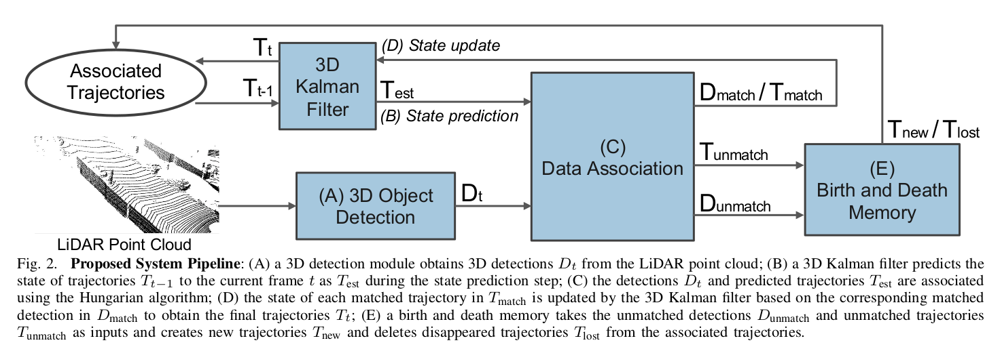
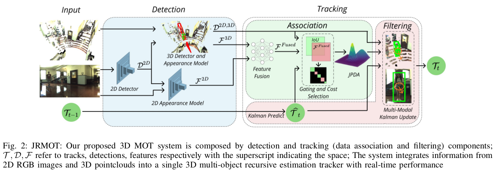

# 单目标跟踪
- 在第一帧给一个bounding box，要求在之后的帧准确和鲁棒地进行跟踪，基本上是将局部信息进行分类和回归。
- 难点
  - 只有第一帧的box先验信息
## CF
- 衡量两信号的相似度
- 设计一个滤波模板，作用在跟踪目标上得到响应最大
### [KCF](KCF.md)
- 目标->padding->循环位移作为样本
- 训练分类器，越靠近目标的区域为正样本的可能性越大
- 上一帧的padding作为预测区域，然后对该区域进行循环移位，使用分类器对这些框框计算响应，通过响应最大的框的相对移位推测目标的位移
- 根据响应最大的框循环移位进行训练再检测

# 多目标跟踪
## tracking-by-detection框架
- 在每帧给定检测出的bounding box，根据帧之间以及帧内部多个box的数据关联。
  - 数据关联方式
    - 最小成本流、马尔可夫决策过程、部分过滤、匈牙利匹配、图割
- 难点
  - 互相遮挡、形变、位移
### deep-sort
- 见对应[笔记](https://github.com/staillyd/deep_sort/tree/master/note)
- 在检测器检测出物体后
  - 构造状态空间方程，进行Kalman滤波,预测track在下一帧的位置大小
  - 根据检测目标的深层特征进行detection和track的匹配(指派问题)
    - 删除kanlam预测的track位置和detection马氏距离过大的匹配对
  - sort:进行iou匹配

### [center-track](CenterTrack.md)
- 结合检测跟踪,输入当前帧图像,上一帧图像,上一帧跟踪的Heatmap结果,输出当前帧的Heatmap
- 当前帧图像,上一帧图像->时间相关的检测结果
- 上一帧跟踪的Heatmap结果->id匹配

### Simple Unsupervised Multi-Object Tracking
- sort得到轨迹,轨迹id当作目标类别,进行ReID训练,替换deep部分
- 

### AB3DMOT
- 3D版本的SORT,将跟踪结果投影到图像进行KITTI的2DMOT评估

- 3D检测框的俯视图的框进行匹配

- 点云的俯视图跟踪
- 点云的前视图跟踪
- 图像的跟踪
- 点云特征+图像特征进行跟踪

### A Real-Time 3D Multi-Object Tracker and a New Large-Scale Dataset

- 图像检测得到2D检测框->获取表观特征
- 点云检测得到3D检测框以及对应特征
- 融合2D、3D特征
- 得到当前检测框与预测轨迹的IOU cost矩阵以及 表观特征cost矩阵
- 基于entropy measure进行成本矩阵的选择(IOU、表观特征),采用联合概率进行匹配

### Robust Multi-Modality Multi-Object Tracking
#### 创新点与贡献
1. 提出具有融合模块的多模式MOT框架
2. 联合优化跨模式的端到端的训练
   - 最小成本流框架下跨模式的端到端训练
3. 首次用点云的深度特征用于跟踪

#### 方案

- 分为四部分:
  1. 目标检测器
  2. 特在提取器
  3. 邻接估计器
  4. 最小化成本流优化器
