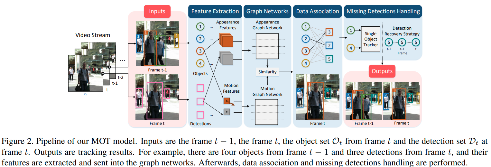
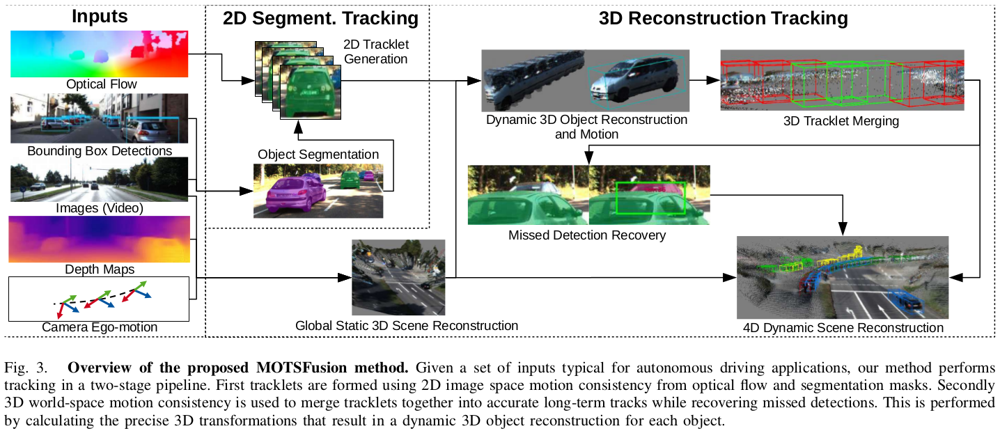
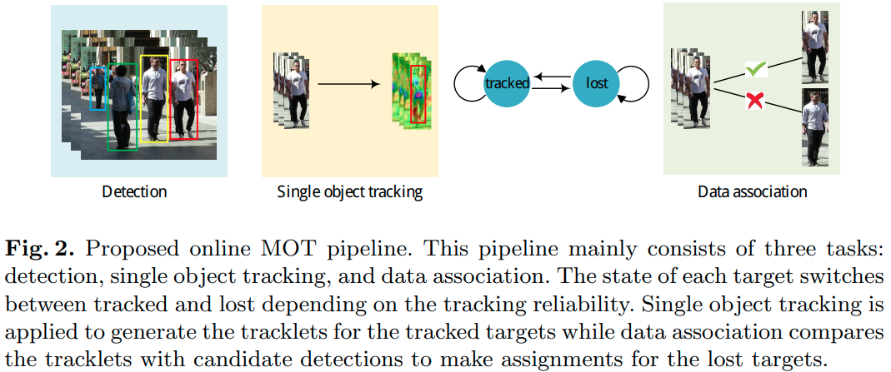

[TOC]

# 单目标跟踪
- 在第一帧给一个bounding box，要求在之后的帧准确和鲁棒地进行跟踪，基本上是将局部信息进行分类和回归。
- 难点
  - 只有第一帧的box先验信息
## CF
- 衡量两信号的相似度
- 设计一个滤波模板，作用在跟踪目标上得到响应最大
### [KCF](KCF.md)
- 目标->padding->循环位移作为样本
- 训练分类器，越靠近目标的区域为正样本的可能性越大
- 上一帧的padding作为预测区域，然后对该区域进行循环移位，使用分类器对这些框框计算响应，通过响应最大的框的相对移位推测目标的位移
- 根据响应最大的框循环移位进行训练再检测

# 多目标跟踪
> 网址
> MOT系列: https://motchallenge.net/
> KITTI: http://www.cvlibs.net/datasets/kitti/eval_tracking.php
> NuScenes: https://www.nuscenes.org/tracking?externalData=all&mapData=all&modalities=Any

- 在每帧给定检测出的bounding box，根据帧之间以及帧内部多个box的数据关联。
  - 数据关联方式
    - 最小成本流、马尔可夫决策过程、部分过滤、匈牙利匹配、图割
- 难点
  - 互相遮挡、形变、位移

## 检测网络、匹配
### 2D
#### SORT
- 检测+Kalman+匈牙利

#### [CenterTrack](CenterTrack.md)
- 结合检测跟踪,输入当前帧图像,上一帧图像,上一帧跟踪的Heatmap结果,输出当前帧的Heatmap
- 当前帧图像,上一帧图像->时间相关的检测结果
- 上一帧跟踪的Heatmap结果->id匹配

#### [TransTrack](TransTrack.md)
- 用transformer方式得到当前检测框,上一帧轨迹在当前帧的位置(类似centerTrack里的偏移量?)
- IOU匹配

> **TODO**
> 3D TransTrack
> fusion TransTrack

### 3D
#### AB3DMOT
- 3D版本的SORT,将跟踪结果投影到图像进行KITTI的2DMOT评估

- 3D检测框的俯视图的框进行匹配

#### CenterPoint
- TOREAD

### 2D+3D
#### Pass
- 点云的俯视图跟踪?
- 点云的前视图跟踪?

## 检测网络、特征网络、匹配
### 2D
#### DeepSort
- 见对应[笔记](https://github.com/staillyd/deep_sort/tree/master/note)
- 在检测器检测出物体后
  - 构造状态空间方程，进行Kalman滤波,预测track在下一帧的位置大小
  - 根据检测目标的深层特征进行detection和track的匹配(指派问题)
    - 删除kanlam预测的track位置和detection马氏距离过大的匹配对
  - sort:进行iou匹配

#### [MPNTrack](MPNTrack.md)
- 匹配方式的不同:图网络->边权重的二分类

1. 给定视频中的对象检测,构建一幅图,节点对应于检测框,边对应于节点之间的连接
2. 将检测框里的图像当作CNN输入,CNN输出节点外观embedding.边界框相对大小、位置、时间距离作为输入向量输入到MLP,MLP输出边的几何embedding.
3. 在图中执行一系列的消息传递步骤,每轮消息传递,节点与其连接边共享外观信息,而边缘与入射节点共享几何信息.
4. 使用最终的边的embedding进行$y_{(i,j)}$的二分类

#### Graph Networks for Multiple Object Tracking
- 特征不同:添加GNN更新提取的特征

1. 特征提取得到外观特帧和运动特征(bbox,2D速度)
2. 构建图神经网络,节点为检测、轨迹最新帧特征,边为节点间的相似度
3. 匈牙利
4. 未跟踪的最新帧轨迹采用SOT进行当前帧的跟踪,未匹配的检测框用线性运动模型推测之前帧目标所在位置

### 3D
#### Pass

### 2D+3D
#### A Real-Time 3D Multi-Object Tracker and a New Large-Scale Dataset

- 图像检测得到2D检测框->获取表观特征
- 点云检测得到3D检测框以及对应特征
- 融合2D、3D特征
- 得到当前检测框与预测轨迹的IOU cost矩阵以及 表观特征cost矩阵
- 基于entropy measure进行成本矩阵的选择(IOU、表观特征),采用联合概率进行匹配

## 检测+特征网络、匹配
### 2D
#### JED

#### FairMOT

### 3D

### 2D+3D

## 检测+特征+匹配网络
### 2D

### 3D

### 2D+3D
#### Robust Multi-Modality Multi-Object Tracking
##### 创新点与贡献
1. 提出具有融合模块的多模式MOT框架
2. 联合优化跨模式的端到端的训练
   - 最小成本流框架下跨模式的端到端训练
3. 首次用点云的深度特征用于跟踪

##### 方案

- 分为四部分:
  1. 目标检测器
  2. 特在提取器
  3. 邻接估计器
  4. 最小化成本流优化器

#### [GNN3DMOT](GNN3DMOT.md)
1. 提取2D和3D特征，采用GNN方式使每一个对象特征会倾向于与它相似的对象的特征
2. 迭代更新GNN网络,对边进行回归,最终输出分配矩阵

## 其他论文
### Simple Unsupervised Multi-Object Tracking
- sort得到轨迹,轨迹id当作目标类别,进行ReID训练,替换deep部分

### Track to Reconstruct and Reconstruct to Track
#### 创新点与贡献
1. 从3D重建获取3D运动丢失的目标检测结果,合并长时间遮挡的轨迹
- 2D估计3D,代替激光雷达?
#### 方案

- 给定一组用于自动驾驶应用的典型输入,首先,使用来自光流和分割蒙版的2D图像空间运动一致性形成第一轨迹。其次,使用3D世界空间运动一致性将小轨迹合并到准确的长期轨迹中,同时恢复错过的检测。
- 绿色的是3D空间中3D运动估计出的

### DMAN:Online Multi-Object Tracking with Dual Matching Attention Networks
#### 创新点与贡献
1. 提出一种空间注意力网络来处理MOT的嘈杂检测和遮挡,
2. 时间注意力网络,不仅考虑目标检测与轨迹中的观测值之间的相似性,而且考虑所有观测值的一致性过滤掉轨迹中的不可靠样本(自适应地将不同的权重分配给不同的样本)
3. 将SOT应用于MOT,提出新的cost

#### pipline

- 在给定的每帧中检测目标，应用SOT跟踪器跟踪每个目标。将目标状态设置为以跟踪，直到跟踪结果变得不可靠为止。
- 当跟踪结果不可靠时，目标视为丢失。暂停SOT跟踪器，执行数据关联，计算轨迹和检测之间的相似度。如果丢失的目标成功关联上之前的跟踪结果，更新跟踪状态并恢复跟踪过程。

### SQE
#### 创新点与贡献
1. 在没有ground truth的情况下自优化跟踪算法的参数，并提出评估指标SQE，反映假设轨迹的内部特征，可以不依赖于ground truth测量跟踪性能

### How To Train Your Deep Multi-Object Tracker
#### 创新点与贡献
1. 对MOTA和MOTP进行微分得到Deep MOT端到端训练的损失函数
2. 提出匈牙利深度网络替代匈牙利算法,端到端的训练