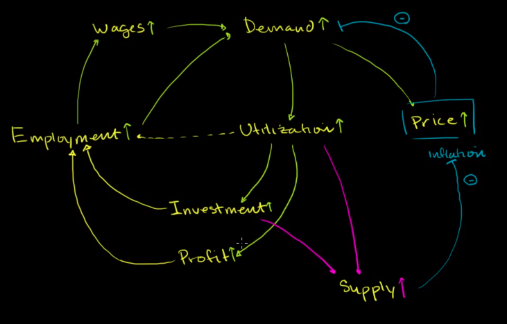
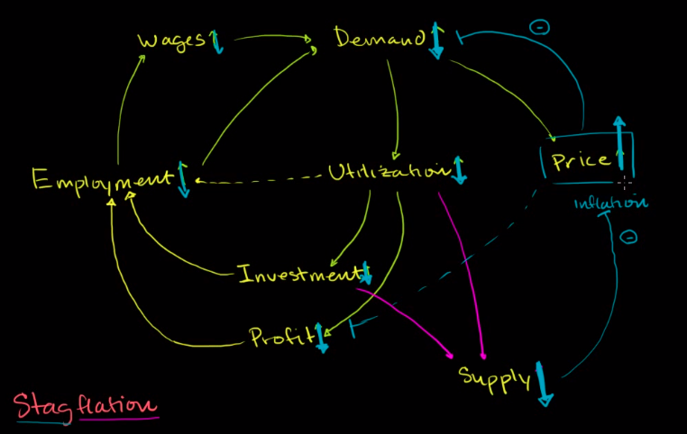
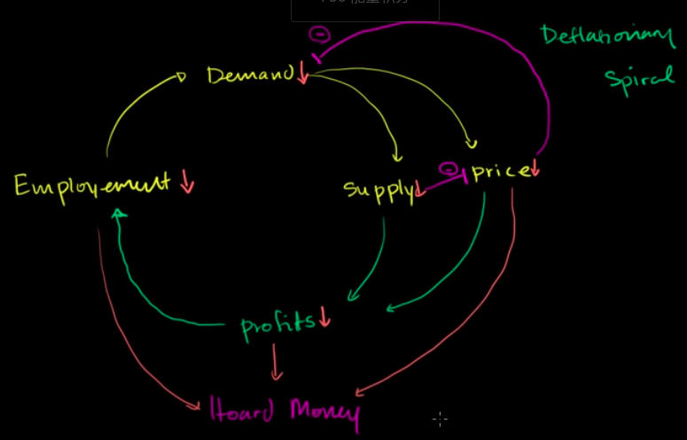

# 通货膨胀
## 通货膨胀(涨价)类型
- 良性正反馈
  - 假设好的就业形式
   

- 停滞性通货膨胀
  - 假如供给突然下跌

## 实际和名义收益率
假设存银行100元，1年后有110元。通货膨胀率为2%。
- 名义收益率
  - (110-100)/100=10%
- 实际收益率(统一时间进行计算)
  - (110-100*(1+2%))/100*(1+2%)=8/102=7.8%

## 产能利用率
Eg:[蛋糕厂](annexs/cupcakes.xls)
- [视频](https://zh.khanacademy.org/economics-finance-domain/core-finance/inflation-tutorial/cap-util-inflation/v/cupcake-economics-2)
- 产能利用率一定程度上表征需求
- 高产能利用率容易导致价格上涨，增加产能，通货膨胀

# 通货紧缩(降价)
- 技术上升,需求下降会导致通货紧缩
- 就业不好，经济萧条
  - 